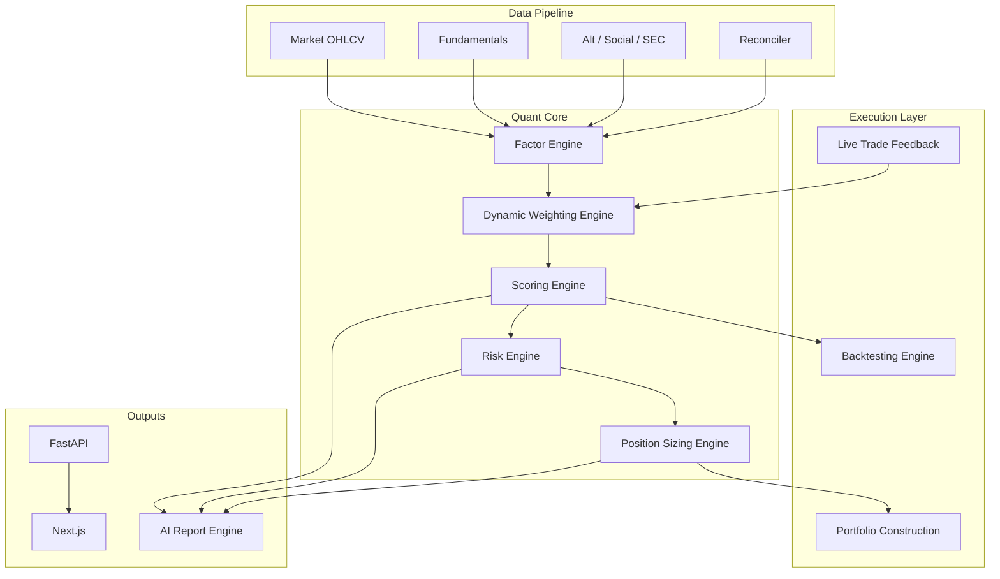

# Institutional Quant Model Architecture (v2)

Target-state design for the Stock Picker platform: **penny (3–10d)**, **medium (4–8w)**, **compounder (multi-year)** sleeves, with a path from the **current codebase** to institutional robustness.

**Companion artifacts**

- AI report JSON Schema: [schemas/ai_research_report_v2.schema.json](schemas/ai_research_report_v2.schema.json)
- SQL extensions (proposed): [schemas/quant_v2_tables.sql](schemas/quant_v2_tables.sql)
- Round 2 remaining work backlog: [ROUND2_REMAINING_WORK.md](ROUND2_REMAINING_WORK.md)
- Business guide (today’s UI): [ANALYZE_PANEL.md](ANALYZE_PANEL.md)
- Today’s API: [API_REFERENCE.md](API_REFERENCE.md)

---

## 0. Current system → target (gap map)

| Engine | Exists today | Upgrade |
|--------|----------------|---------|
| **Factor** | `scoring/technical.py`, `sentiment.py`, `fundamental.py`, screener-specific signals | Factor registry, sleeve factor packs, OBV/flow/percentile valuation |
| **Scoring** | `WeightedSignal` + `composite_score()` in `screeners/base.py` | Dynamic weights, unified pipeline |
| **Risk** | `services/alerts.py`, `openbb_governance`, `valuation_warnings` | Unified `RiskScore` 0–100 + deductions |
| **Dynamic weighting** | `scoring/regime.py` (vol + sector tilt) | IC/IR, decay, 5 regimes, monthly rebalance |
| **Portfolio** | `portfolio_summary_service.py`, `portfolio_optimizer.py`, `rebalance_service.py`, `policy_backtest.py`, `/portfolio` UI (5 tabs) | Canonical ledger summary (`GET /portfolio/summary`), optimize → rebalance preview (`POST /portfolio/rebalance-preview`), factor exposure, policy backtest |
| **Backtest** | `ml/backtest_*.py`, vectorbt adapter, sweep | Costs, slippage, survivorship, portfolio BT |
| **Live feedback** | Trade journal, `scripts/factor_validation.py` (IC) | Automated weight updates, factor retire/promote |
| **Prediction loop** | `score_attribution`, trade journal predictions | `prediction_snapshots` + `prediction_outcomes` on every v2 score |
| **Valuation** | P/E warning strings, percentile factors | DCF + peer multiples + reverse DCF (`engines/valuation/`) |
| **AI report** | `services/research_report.py` (8 sections) | 10-section v2 JSON + position sizing block |

---

## 1. System architecture

### 1.1 Logical engines



### 1.2 Recommended technology stack

| Layer | Choice | Notes |
|-------|--------|-------|
| API | **FastAPI** (keep) | Async jobs for scans; sync for single-symbol |
| UI | **Next.js** (keep) | Workspace, Portfolio, Library |
| OLTP DB | **PostgreSQL** (prod) / SQLite (local) | Migrate from SQLite when AUM & concurrency grow |
| Time-series | **Parquet** on disk + `daily_quotes` table | Factor panels for IC/IR |
| Queue | **Redis** or DB job table (keep scan jobs) | Nightly factor refresh, IC jobs |
| Compute | **pandas**, **numpy**, **ta** | Factor computation |
| Backtest | **vectorbt** + in-repo sim (keep) | Portfolio-level in Phase 4 |
| ML (optional) | **scikit-learn** / **LightGBM** | Factor weight learner, not in request path |
| LLM | Proxy-compatible (keep `llm_explainer`) | Report narrative sections |
| Orchestration | **APScheduler** (keep `scheduler.py`) | EOD ingest, monthly weight rebalance |

### 1.3 Proposed backend folder structure

```text
backend/
  engines/
    factor/           # FactorEngine, registry, sleeve packs
    weighting/        # IC/IR, decay, regime classifier, WeightStore
    scoring/          # ScoringEngine (orchestrates factor + weights)
    risk/             # RiskEngine (macro, company, event)
    sizing/           # PositionSizingEngine
    portfolio/        # wraps optimizer + policy (move from services/)
    backtest/         # institutional runner (wraps ml/)
    feedback/         # LiveTradeFeedback, attribution
    report/           # AIReportEngine v2
  screeners/          # thin: hard_filter + calls ScoringEngine
  scoring/            # low-level math (migrate gradually)
  data/               # unchanged role
  api/                # routes call engines.*
  models/             # Pydantic v2 schemas
  jobs/               # nightly_ic, rebalance_weights, factor_panel
```

**Migration rule:** keep `screeners/penny|medium|compounder.py` API-compatible; internally call `ScoringEngine.score(symbol, sleeve)`.

---

## 2. Database schema (extensions)

Existing tables (`historical_store.py`): `daily_quotes`, `fundamental_snapshots`, `factor_snapshots`, `data_quality_flags`, `job_logs`.

**New tables** (see [schemas/quant_v2_tables.sql](schemas/quant_v2_tables.sql)):

| Table | Purpose |
|-------|---------|
| `factor_definitions` | factor_id, sleeve, formula version, criticality |
| `factor_values` | symbol, date, factor_id, raw_value, norm_score |
| `factor_ic_history` | factor_id, sleeve, date, IC, IR, hit_rate |
| `factor_weights` | sleeve, regime, factor_id, weight, effective_from |
| `market_regimes` | date, regime_label, features JSON |
| `risk_scores` | symbol, date, sleeve, risk_score, breakdown JSON |
| `score_attribution` | symbol, date, raw_score, adjustments JSON |
| `position_recommendations` | symbol, date, sizing JSON |
| `trade_predictions` | trade_id, expected_return, factor_snapshot |
| `trade_outcomes` | trade_id, actual_return, error, attribution |
| `backtest_runs` | run_id, config, metrics JSON |
| `ai_reports_v2` | symbol, report JSON, schema_version |

---

## 3. API architecture

### 3.1 Versioning

- Prefix: `/api/v2/` for new institutional contracts.
- Keep `/analyze/{symbol}` stable; add fields behind `?schema=v2`.

### 3.2 New / extended endpoints

| Method | Path | Engine |
|--------|------|--------|
| GET | `/api/v2/factors/{symbol}?sleeve=` | Factor |
| GET | `/api/v2/score/{symbol}?sleeve=` | Scoring + Risk + Sizing |
| GET | `/api/v2/weights/{sleeve}?regime=` | Dynamic weighting |
| POST | `/api/v2/weights/rebalance` | Monthly job trigger (admin) |
| GET | `/api/v2/risk/{symbol}` | Risk |
| GET | `/api/v2/sizing/{symbol}?portfolio_id=` | Position sizing |
| POST | `/api/v2/backtest/portfolio` | Portfolio backtest |
| POST | `/api/v2/feedback/trade` | Link trade outcome → attribution |
| GET | `/api/v2/report/{symbol}` | AI report v2 JSON |
| GET | `/api/v2/factors/ic?factor_id=&sleeve=` | IC/IR history |

### 3.3 Service orchestration (single-symbol)

```text
GET /api/v2/score/{symbol}
  → DataReconciler.reconcile()
  → FactorEngine.compute_all(symbol, sleeve)
  → WeightStore.get_weights(sleeve, current_regime)
  → ScoringEngine.composite(factors, weights)
  → RiskEngine.assess() → deductions
  → PositionSizingEngine.recommend()
  → persist factor_snapshots + score_attribution
```

---

## 4. Dynamic factor weighting engine

### 4.1 Notation

- Factors \(i = 1..N\), sleeve \(s\), date \(t\)
- \(f_{i,t}\): cross-sectionally normalized factor score (0–100) at \(t\)
- \(r_{t+h}\): forward return over horizon \(h\) (sleeve-specific: penny \(h=5d\), medium \(h=20d\), compounder \(h=252d\))

### 4.2 Information Coefficient (rolling)

\[
IC_{i,t} = \mathrm{corr}\big( f_{i,t-T:t},\; r_{t+h:t+T} \big)
\]

Default \(T = 60\) trading days (config per sleeve).

### 4.3 Information Ratio

\[
IR_{i,t} = \frac{\overline{IC_{i}}}{\sigma(IC_{i})}
\]

### 4.4 Factor decay

\[
decay_{i,t} = \frac{IC_{i,t}^{(30d)}}{IC_{i,t}^{(180d)}}
\]

If \(|decay_{i,t}| < 0.5\) → flag **decay**; weight multiplier \(m_i = \max(0, decay_{i,t})\).

### 4.5 Base weight from IC/IR (softmax)

\[
z_{i,t} = \alpha \cdot IC_{i,t} + \beta \cdot IR_{i,t}
\]
\[
w_{i,t}^{raw} = \frac{\exp(z_{i,t})}{\sum_j \exp(z_{j,t})}
\]
\[
w_{i,t} = m_i \cdot w_{i,t}^{raw},\quad w_{i,t} \leftarrow \frac{w_{i,t}}{\sum_j w_{j,t}}
\]

Defaults: \(\alpha=1.0\), \(\beta=0.5\). Floor: \(w_{i,t} \geq w_{min}\) (e.g. 2%) then renormalize.

### 4.6 Market regime detection

**Features** (SPY, 6–12m window):

- \(R_{6m}\): 6-month total return
- \(\sigma_{20d}\): realized vol (annualized)
- \(MA_{50}, MA_{200}\): trend structure

**Classifier rules** (first match):

| Regime | Rule (illustrative) |
|--------|---------------------|
| **Bull** | \(R_{6m} > 8\%\) and price > MA200 and \(\sigma_{20d} < 25\%\) |
| **Bear** | \(R_{6m} < -8\%\) and price < MA200 |
| **Sideways** | \(|R_{6m}| \leq 8\%\) and \(|\mathrm{slope}_{50d}| < \epsilon\) |
| **High vol** | \(\sigma_{20d} \geq 28\%\) |
| **Low vol** | \(\sigma_{20d} \leq 14\%\) |
| **Neutral** | else |

Store daily in `market_regimes`.

### 4.7 Regime weight overlays

Let \(w_{i,t}^{base}\) from §4.5. Apply sleeve-specific overlay matrix \(A_{s,regime}\):

\[
w_{i,t}^{final} = \frac{A_{s,r(t),i} \cdot w_{i,t}^{base}}{\sum_j A_{s,r(t),j} \cdot w_{j,t}^{base}}
\]

**Example overlays (medium sleeve)** — multiply base weight:

| Factor | Bull | Bear | Sideways | High vol | Low vol |
|--------|------|------|----------|----------|---------|
| RS vs SPY | 1.25 | 0.70 | 1.00 | 0.85 | 1.10 |
| Technical setup | 1.15 | 0.90 | 1.05 | 0.95 | 1.00 |
| Sector strength | 1.20 | 0.80 | 1.00 | 0.90 | 1.05 |
| Sentiment | 1.10 | 1.00 | 0.95 | 1.15 | 0.90 |
| Governance | 0.90 | 1.20 | 1.10 | 1.10 | 1.00 |

**Penny:** boost volume/sentiment in bull/sideways; cut in bear/high vol.  
**Compounder:** boost quality/moat in bear/low vol; cut momentum proxies in bull.

### 4.8 Monthly rebalance

- **Calendar:** first trading day of month after IC panel refresh.
- **Smoothing:** \(w_{new} = \lambda w_{old} + (1-\lambda) w_{est}\), \(\lambda = 0.5\) to avoid turnover in weights.
- **Constraints:** max single-factor weight 35%, min 2% if factor active.

**Today:** replace static `WeightedSignal(..., weight=0.22)` in screeners with `WeightStore.load(sleeve, regime)`.

---

## 5. Sleeve-specific factor design

All factor scores map to **\(s \in [0,100]\)** via clipped linear or percentile transforms:

\[
\mathrm{clip100}(x; a, b) = 100 \cdot \frac{\mathrm{clip}(x,a,b)-a}{b-a}
\]

### 5.1 Penny sleeve

| Factor ID | Formula (conceptual) | Maps from today |
|-----------|----------------------|-----------------|
| `rel_volume` | \(V_t / \overline{V}_{20}\) → clip100(1→3) | partial `volume_spike_score` |
| `volume_surge` | z-score of volume vs 20d | `volume_spike_score` |
| `breakout_strength` | `breakout_score(hist)` | exists |
| `social_sentiment` | `combined_sentiment` | exists |
| `sentiment_pos` | positive share of buzz | **new** |
| `sentiment_neg` | inverse of negative share | **new** |
| `intraday_vol` | (high-low)/close ATR% | `volatility_fit_score` |
| `limit_up_freq` | count limit-up days / 20 | **new** (US: gap+vol proxy) |
| `float_size` | percentile(float shares) inverted | **new** |
| `liquidity` | dollar vol percentile | hard filter + score |

**Hard filters** (fail → exclude or cap score at 40):

- `delisting_risk`: exchange notice / price < $1 for 30d
- `st_status`: symbol flagged ST/*ST (if CN ADR mapping) or OTC only
- `persistent_losses`: negative EPS 3Y
- `liquidity`: 20d avg dollar volume < `PENNY_MIN_DOLLAR_VOLUME_20D`

**Composite (penny):**

\[
S_{penny} = \sum_i w_i^{penny,r} \cdot s_i
\]

**Static starter weights** (until IC live): rel_vol 0.20, vol_surge 0.20, breakout 0.15, social 0.15, pos_sent 0.10, neg_sent 0.05, intraday_vol 0.10, float 0.05.

### 5.2 Medium sleeve

| Factor ID | Formula | Today |
|-----------|---------|-------|
| `rs_spy_20d` | `relative_strength_vs_spy(20d)` | exists |
| `trend_quality` | ADX + MA alignment composite | partial `trend_score` |
| `obv_slope` | OBV regression slope percentile | **new** |
| `capital_flow` | CMF or MFI percentile | **new** |
| `institutional_buy` | proxy: large-block vol / total | **new** (data permitting) |
| `chip_concentration` | holder concentration change | **new** |
| `sector_strength` | `sector_relative_strength` | exists |
| `earnings_revision` | revision breadth proxy (estimates Δ) | **new** |

**Starter weights:** rs 0.18, trend 0.16, obv 0.12, flow 0.12, inst 0.10, chip 0.08, sector 0.14, earn_rev 0.10.

**Technical setup (legacy):** \(s_{tech} = (MACD + breakout + trend)/3\) — decompose into explicit factors above over time.

### 5.3 Compounder sleeve

| Factor ID | Formula | Today |
|-----------|---------|-------|
| `rev_growth` | YoY revenue growth percentile | partial |
| `eps_growth` | YoY EPS growth (adjusted) | partial |
| `roic` | ROIC percentile vs industry | partial `roic_margin_stability` |
| `fcf_yield` | FCF / EV percentile | **new** |
| `debt_ratio` | net debt / EBITDA inverted score | **new** |
| `goodwill_ratio` | goodwill/assets penalty | **new** |
| `capex_efficiency` | ΔFCF / capex | **new** |
| `gross_margin` | level + trend | partial |
| `operating_margin` | level + trend | partial |
| `dividend_growth` | 5y DPS CAGR | **new** |
| `pe_pct_5y` | historical PE percentile (inverted for value) | **new** |
| `pb_pct_5y`, `ps_pct_5y` | same | **new** |

**Adjusted earnings:**

\[
EPS_{adj} = EPS_{reported} - \sum one\_offs
\]

Exclude symbols where \(|oneoffs| / |EPS| > 50\%\) unless flagged.

**Industry percentile:**

\[
s_{factor} = 100 - P_{industry}(x_{factor})
\]

for “higher is better” metrics; reverse for debt, goodwill.

**Starter weights:** rev 0.14, eps 0.12, roic 0.14, fcf 0.12, debt 0.08, goodwill 0.04, capex 0.06, margins 0.10, div 0.05, pe/pb/ps 0.15 (split).

---

## 6. Scoring engine

### 6.1 Pipeline

\[
S_{raw} = \frac{\sum_i w_i \cdot s_i}{\sum_i w_i}
\]

\[
S_{dq} = S_{raw} \cdot \phi(DQ)
\]

\[
S_{risk} = \mathrm{clip100}\big(S_{dq} - \Delta_{risk}\big)
\]

\[
S_{final} = \mathrm{clip100}\big( \gamma_{regime} \cdot S_{risk} + \tau_{sector} \big)
\]

- \(\phi(DQ)\): data quality multiplier (§7)
- \(\Delta_{risk}\): sum of risk deductions (§8)
- \(\gamma_{regime}\): vol multiplier (today `regime.py`)
- \(\tau_{sector}\): sector tilt points (today)

**Map to UI:** `score` = \(S_{final}\), `metrics.raw_score` = \(S_{raw}\).

---

## 7. Data quality framework

### 7.1 Tier weights

| Tier | Fields | Weight share |
|------|--------|--------------|
| **Critical** | revenue, EPS, shares out, operating CF | 60% |
| **Important** | market cap, debt, margins, PE | 25% |
| **Secondary** | social, analyst counts, alt data | 15% |

Per-field score \(q_k \in [0,1]\) from reconcile confidence (high=1, med=0.7, low=0.4, missing=0).

\[
DQ = 100 \cdot \frac{\sum_k \omega_k q_k}{\sum_k \omega_k}
\]

### 7.2 Penalty function

\[
\phi(DQ) =
\begin{cases}
1.00 & DQ \geq 75 \\
0.97 & 55 \leq DQ < 75 \\
0.90 & 40 \leq DQ < 55 \\
0.82 & 25 \leq DQ < 40 \\
0.70 & DQ < 25
\end{cases}
\]

Aligns with `adjust_score_for_data_quality()` — **unify** into one module.

### 7.3 Missing critical data

If any critical field missing: cap \(S_{final} \leq 60\) and force `risk_flag = low_data_quality`.

---

## 8. Risk engine

### 8.1 Layers

| Layer | Examples | Source today |
|-------|----------|--------------|
| **Macro** | rates, inflation, FX, regulation, GDP | FRED / OpenBB macro |
| **Company** | earnings date, insider sell, unlock, offering, liquidity | Finnhub, OpenBB |
| **Event** | 8-K, lawsuits, fraud headlines, CEO change | News + SEC |

### 8.2 Severity score

Each event \(e\) has severity \(se \in \{1,2,3\}\) (low/med/high) and category weights.

\[
RiskScore = \mathrm{clip100}\left( \sum_e w_e \cdot s_e \cdot 33.3 \right)
\]

where \(s_e \in [0,1]\) is confidence.

### 8.3 Automatic score deductions \(\Delta_{risk}\)

| Condition | Deduction (points) |
|-----------|------------------|
| Earnings ≤ 7 days | 8 |
| Governance < 45 | 10 |
| Insider sell cluster | 6 |
| Secondary offering (90d) | 12 |
| Data quality < 40 | 15 |
| Fraud/litigation headline | 20 |

### 8.4 Position size multiplier from risk

\[
m_{risk} = 1 - 0.006 \cdot RiskScore
\]

(clamp \(m_{risk} \in [0.4, 1.0]\))

---

## 9. Position sizing model

### 9.1 Inputs

- \(S_{final}\): composite 0–100
- \(DQ\): data quality 0–100
- \(R\): risk score 0–100
- \(E\): current portfolio gross exposure (0–1)
- \(N\): active positions count
- Sleeve max weight cap \(W_{sleeve}^{max}\) (penny 3%, medium 8%, compounder 15%)

### 9.2 Base weight (conviction)

\[
c = \mathrm{clip}\left( \frac{S_{final} - 50}{50},\; 0,\; 1 \right)
\]

\[
w_{base} = W_{sleeve}^{max} \cdot c^2
\]

Squaring penalizes mediocre scores.

### 9.3 Adjustments

\[
w_1 = w_{base} \cdot \phi(DQ) \cdot m_{risk}
\]

\[
w_2 = w_1 \cdot (1 - E)^{0.5}
\]

Portfolio exposure dampener: full invested book → smaller new names.

### 9.4 Recommended vs max

\[
w_{rec} = \mathrm{clip}(w_2,\; w_{min},\; W_{sleeve}^{max})
\]
\[
w_{max} = \min(1.25 \cdot w_{rec},\; W_{sleeve}^{max})
\]

### 9.5 Stop loss %

| Sleeve | Formula |
|--------|---------|
| Penny | \(stop = 2.5 \times ATR\%_{14}\) (min 8%, max 20%) |
| Medium | \(stop = 1.8 \times ATR\%_{14}\) (min 5%, max 12%) |
| Compounder | \(stop = 3.0 \times ATR\%_{14}\) (min 15%, max 35%) |

### 9.6 Example

Medium sleeve, \(S_{final}=78\), \(DQ=82\), \(R=25\), \(E=0.6\), \(W_{max}=8\%\):

- \(c = (78-50)/50 = 0.56\)
- \(w_{base} = 0.08 \times 0.56^2 = 2.51\%\)
- \(\phi(82)=1\), \(m_{risk}=1-0.006\times25=0.85\)
- \(w_1 = 2.13\%\), \(w_2 = 2.13 \times \sqrt{0.4} = 1.35\%\)

**Output:** recommended 1.4%, max 1.8%, stop ~7%, portfolio slot 1.4%.

Expose via `GET /api/v2/sizing/{symbol}` and Analyze report §10.

---

## 10. Backtesting engine (institutional)

### 10.1 Requirements mapping

| Requirement | Design |
|-------------|--------|
| Portfolio-level | Extend `policy_backtest.py` + vectorbt portfolio |
| Transaction costs | bps per side + min ticket |
| Slippage | \(\mathrm{slip} = k \cdot \mathrm{ATR}\% \cdot \mathrm{notional}\) |
| Liquidity | max participation rate of 20d ADV |
| Delisting | remove symbol at last trade; cash recovery at last price × (1-50%) |
| Survivorship | point-in-time universe table `universe_pit` |

### 10.2 Cost model

\[
cost_{trade} = \mathrm{notional} \cdot (fee_{bps} + slip_{bps}) / 10^4
\]

Default: fee 5 bps, slip 10 bps (sleeve-specific).

### 10.3 Metrics (store per run)

CAGR, Sharpe, Sortino, win rate, max DD, Calmar, alpha vs SPY, beta, turnover, exposure.

\[
Sortino = \frac{\mathbb{E}[r - r_f]}{\sigma_{down}(r)}
\]

\[
Calmar = \frac{CAGR}{|MaxDD|}
\]

### 10.4 Schema

`backtest_runs` + `backtest_equity_curve` + `backtest_trades` (see SQL file).

**API:** `POST /api/v2/backtest/portfolio` with same knobs as today’s policy backtest + cost flags.

---

## 11. Live trade feedback loop

### 11.1 Record at entry

`trade_predictions`:

- expected return \(\hat{r}\) from sleeve horizon model
- factor vector \(s_i\) and weights \(w_i\)
- \(S_{final}\), \(DQ\), \(R\)

### 11.2 Record at exit

`trade_outcomes`:

- actual return \(r\)
- error \(e = r - \hat{r}\)
- factor attribution: \(\beta_i = s_i \cdot e\) (simplified) or Shapley from stored vector

### 11.3 Monthly learning job

1. Regress \(r\) on \(s_i\) cross-sectionally → update IC panel.
2. **Retire** factor if \(IR < 0.3\) for 6 months.
3. **Promote** shadow factor if \(IR > 1.0\) for 3 months in paper portfolio.
4. Optional: **Bayesian weight update** — prior weights + likelihood from last 90d trades.

\[
w_{i,new} \propto w_{i,old} \cdot \exp(\eta \cdot IC_{i,trades})
\]

\(\eta\) small (0.1) to avoid overfitting.

### 11.4 Integration with journal

Extend `routes_trades.py` on close:

- call `feedback.record_outcome(trade_id)`
- nightly job updates `factor_weights`

---

## 12. AI research report engine (v2)

### 12.1 Sections (JSON)

1. Executive Summary  
2. Investment Thesis (bull / bear / edge)  
3. Key Catalysts  
4. Risks (with `risk_score`, deductions)  
5. Quantitative Analysis (factors, regime, IC status)  
6. Fundamental Analysis  
7. Technical Analysis  
8. Valuation Analysis (percentiles)  
9. Position Sizing Recommendation  
10. Final Rating  

Schema: [schemas/ai_research_report_v2.schema.json](schemas/ai_research_report_v2.schema.json).

### 12.2 Generation flow

```text
build_report_v2(symbol, sleeve):
  payload = orchestrate v2 score API
  narrative = LLM.fill_sections(payload)  # optional per section
  validate against JSON schema
  cache + save to ai_reports_v2 / library
```

**Migrate** from `research_report.py` 8-section dict without breaking old reports.

---

## 13. Implementation roadmap

### Phase 1 — Foundation (2–3 weeks)

- [x] `factor_definitions` + `FactorEngine` registry (`backend/engines/factor/`, seeded on startup)
- [x] Unify `data_quality` + `risk` into `engines/scoring`, `engines/risk`
- [x] `score_attribution` persistence on analyze (`PERSIST_SCORE_ATTRIBUTION`) and v2 score
- [x] API `GET /api/v2/score/{symbol}` parallel to v1 (`backend/api/routes_v2.py`)

### Phase 2 — Dynamic weights (3–4 weeks)

- [x] Nightly IC panel job (`engines/weighting/ic_panel.py`, `scripts/factor_validation.py --panel`)
- [x] `market_regimes` classifier (`engines/weighting/regime_classifier.py`)
- [x] `WeightStore` + rebalance (`engines/weighting/weight_store.py`, scheduler `quant_daily_jobs`)
- [x] Wire screeners + `FactorEngine` to dynamic weights (`DYNAMIC_WEIGHTS_ENABLED`)

### Phase 3 — Sleeve factor expansion (4–6 weeks)

- [x] Penny: float, limit-up proxy, sentiment pos/neg (`scoring/penny_factors.py`, `catalog_v3`)
- [x] Medium: OBV, CMF, earnings revision proxy (`scoring/flow.py`, `scoring/medium_factors.py`)
- [x] Compounder: percentile PE/PB/PS, FCF, adjusted EPS (`scoring/compounder_v3.py`)
- [x] Hard filters table-driven per sleeve (`engines/filters/hard_filters.py`, `HARD_FILTERS_V3_ENABLED`)

### Phase 4 — Risk + sizing (2 weeks)

- [x] Unified risk API `GET /api/v2/risk/{symbol}` (`engines/risk/unified.py`)
- [x] `PositionSizingEngine` + `GET /api/v2/sizing/{symbol}` + Analyze sidebar block
- [x] AI report v2 behind `AI_REPORT_SCHEMA=v2` (`services/research_report_v2.py`, `/api/v2/report/{symbol}`)

### Phase 5 — Institutional backtest (3–4 weeks)

- [x] Costs, slippage, ADV constraints (`engines/backtest/`)
- [x] `universe_pit` for survivorship (`engines/backtest/universe_pit.py`)
- [x] Portfolio backtest UI + `POST /api/v2/backtest/portfolio`

### Phase 6 — Live feedback (3 weeks)

- [x] `trade_predictions` / `trade_outcomes` (`engines/feedback/`, journal hooks)
- [x] Factor retire/promote admin view (`GET /api/v2/factors/admin`)
- [ ] Optional LightGBM weight overlay (offline train only)

### Phase 7 — Production hardening

- [x] PostgreSQL migration path (`data/db_engine.py`, `scripts/migrate_sqlite_to_postgres.py`, `docs/POSTGRES_MIGRATION.md`)
- [x] Job queue for IC/scan (`JOB_QUEUE_BACKEND=sync|db|redis`, `scripts/run_job_worker.py`)
- [x] Audit logs + version pinning (`quant_audit_logs`, `GET /api/v2/version`, `GET /api/v2/audit`)

---

## 14. Configuration flags (add to `.env.example`)

```env
DYNAMIC_WEIGHTS_ENABLED=false
FACTOR_IC_LOOKBACK_DAYS=60
WEIGHT_REBALANCE_LAMBDA=0.5
RISK_ENGINE_V2=false
POSITION_SIZING_V2=false
AI_REPORT_SCHEMA=v1
BACKTEST_INSTITUTIONAL=false
```

---

## 15. Summary

This design **preserves** your three-sleeve product and existing FastAPI/Next.js stack while introducing:

- **Adaptive** factor weights (IC/IR, decay, regimes)
- **Explicit** risk and sizing suitable for real capital allocation
- **Institutional** backtest and feedback loops
- **Structured** AI output for compliance and review

Implement incrementally behind feature flags; keep v1 analyze responses stable until v2 is validated on paper portfolio.

*Not investment advice. For engineering and research workflow design.*
