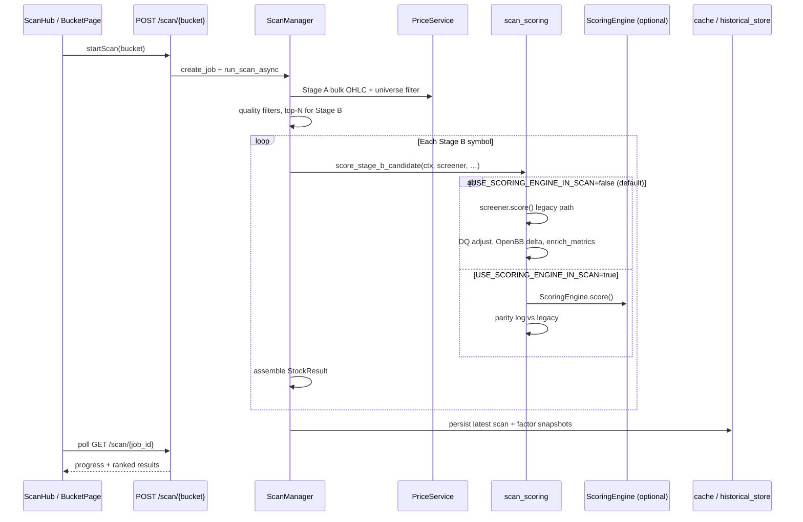
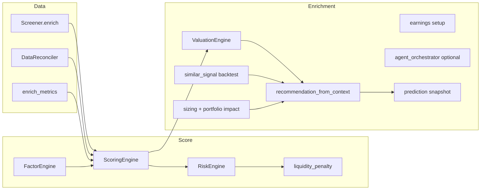

# Post-Update Project Audit

**Date:** 2026-06-05  
**Scope:** Full-repo read-only audit after recent quant/research work (unified backtest metrics, walk-forward research, factor exposure, pairs research, report narrative refactor, `quant_core`, scan scoring unification scaffold, volatility/VaR risk v2, time-series diagnostics).  
**Companion docs:** [PROJECT_INVENTORY.md](PROJECT_INVENTORY.md), [INSTITUTIONAL_QUANT_ARCHITECTURE.md](INSTITUTIONAL_QUANT_ARCHITECTURE.md), [ROUND2_REMAINING_WORK.md](ROUND2_REMAINING_WORK.md).  
**Note:** `docs/CODEBASE_AUDIT_FOR_QUANT_ROADMAP.md` was referenced in the brief but is **not present** in the repo at audit time.

---

## 1. Current monorepo structure

```text
Stock picker 美股/
├── frontend/                 # Next.js 16 App Router (src/app, src/components, src/lib)
├── backend/
│   ├── api/                  # 17 FastAPI route modules
│   ├── services/             # Orchestration (scan, quant v2, reports, jobs, integrations)
│   ├── engines/              # Quant engines (scoring, factor, risk, sizing, backtest, …)
│   ├── screeners/            # Bucket screeners (penny / medium / compounder)
│   ├── scoring/              # Legacy signal implementations (used by FactorEngine)
│   ├── ml/                   # Per-symbol backtest runners + vectorbt adapter
│   ├── quant_core/           # Pure time-series utilities (returns, labels, diagnostics)
│   ├── quant/                # contracts.py only (ModelMetadata)
│   ├── data/                 # Price, cache, reconciler, historical store
│   ├── models/               # Pydantic schemas (v1 + v2)
│   ├── scripts/              # CLI: quant jobs, walk-forward, factor validation
│   └── tests/                # 23 pytest modules
├── docs/                     # Architecture, runbooks, integration guides
├── scripts/                  # dev-up/down, seed, check-secrets
├── .env.example
└── README.md
```

**Storage:** SQLite local-first (`data_store/`, SQLAlchemy + quant tables). Postgres migration doc exists but not required for local dev.

**Strategy buckets:** `penny`, `medium`, `compounder` — consistent across screeners, API, and UI.

---

## 2. Current backend architecture

### Layering (target vs practice)

| Layer | Location | Role |
|-------|----------|------|
| **API** | `backend/api/routes_*.py` | HTTP, validation, thin delegation |
| **Services** | `backend/services/` | Jobs, reports, scan orchestration, v2 pipeline entry |
| **Engines** | `backend/engines/` | Deterministic quant logic |
| **Legacy scoring** | `backend/scoring/` | Factor math consumed by `FactorEngine` |
| **Screeners** | `backend/screeners/` | Universe filter + legacy `score()` for Stage B |
| **Data** | `backend/data/` | Providers, cache, reconcile, PIT fundamentals |
| **ML backtests** | `backend/ml/` | Trade-list simulators (v1 `/backtest` routes) |

### Engine map (implemented)

| Engine | Path | Used by |
|--------|------|---------|
| **FactorEngine** | `engines/factor/engine.py` | ScoringEngine |
| **ScoringEngine** | `engines/scoring/engine.py` | v2 score, optional scan Stage B |
| **RiskEngine** | `engines/risk/engine.py`, `unified.py`, `volatility.py` | v2, scan (when engine path) |
| **PositionSizingEngine** | `engines/sizing/engine.py` | v2 sizing API |
| **RecommendationEngine** | `engines/recommendation/engine.py` | v2 recommendation block |
| **ValuationEngine** | `engines/valuation/engine.py` | v2 valuation |
| **IC / weights** | `engines/weighting/ic_panel.py`, `weight_store.py` | Daily jobs, `/api/v2/factors/*` |
| **Backtest (institutional)** | `engines/backtest/institutional.py`, `metrics.py` | Policy backtest, v2 portfolio BT |
| **Research (new)** | `walk_forward_research_service`, `factor_exposure_service`, `pairs_research_service` | `/research/*`, `/portfolio/factor-exposure` |
| **Report narrative** | `report_llm_context.py`, `report_narrative.py` | v2 report, `/explain` (quant context) |

### Config-driven behavior

Quant behavior is heavily flag-gated in `backend/config.py` with optional runtime JSON overrides (`utils/runtime_flags.py`). Defaults favor **safe local dev** (many integrations off; v2 score on; scan engine path off).

---

## 3. Current frontend architecture

| Area | Path | Notes |
|------|------|-------|
| **Routes** | `frontend/src/app/` | App Router; 7 legacy redirects |
| **Pages-as-shells** | `frontend/src/components/*Page.tsx` | Business logic in components, not RSC data loaders |
| **API client** | `frontend/src/lib/api.ts` | Single ~500-line fetch wrapper |
| **Types** | `frontend/src/lib/types.ts` | Mirrors backend DTOs partially |
| **i18n** | `frontend/src/lib/i18n/` | en/zh via context + localStorage |
| **Charts** | Recharts in `PriceChart`, portfolio equity, quant breakdown |

**Stack:** Next.js 16, React 19, Tailwind 4, TypeScript 5. No SWR/React Query; no frontend test runner.

**Primary UX hubs:** `/` (home), `/workspace` (research), `/scan`, `/portfolio`, `/library`, `/settings`. `/trader-intel` exists but is not in main nav.

---

## 4. Scan flow: UI click → ranked results



**Ranking:** Results sorted by final `score` on each `StockResult`. Display enrichment via `scan_display.enrich_scan_display` (return metrics, labels).

---

## 5. Does ScanManager use ScoringEngine?

**Indirectly only.** `ScanManager` calls `services.scan_scoring.score_stage_b_candidate()` — it does **not** import `ScoringEngine` directly.

**Flag:** `USE_SCORING_ENGINE_IN_SCAN` (default **`false`** in `config.py`).

When `true`, `scan_scoring.py` routes Stage B through `ScoringEngine.score()` and logs parity vs legacy. Tests: `tests/test_scan_scoring_engine_parity.py`.

---

## 6. Does legacy screener scoring still affect production rankings?

**Yes, by default.**

| Path | Production impact |
|------|-------------------|
| **Scan Stage B** | Legacy `screener.score()` unless `USE_SCORING_ENGINE_IN_SCAN=true` |
| **GET /analyze/{symbol}** | v1 analyze via `watchlist_scanner.analyze_symbol` → screener scoring |
| **GET /api/v2/score/{symbol}** | Full v2 pipeline (ScoringEngine) — used in Insights tab, not scan table |

**Implication:** Scan rankings and Workspace **Quant** tab (v1 analyze) can **diverge** from **Insights** (v2 score) for the same symbol/sleeve. `quant_v2_service` optionally logs `parity_delta` when validating against legacy analyze.

---

## 7. Quant v2 flow (current)



| Component | Entry | Persistence / output |
|-----------|--------|----------------------|
| **ScoringEngine** | `build_v2_score()` | Attribution rows if `PERSIST_SCORE_ATTRIBUTION` |
| **FactorEngine** | Inside ScoringEngine | Factor snapshots → HistoricalStore |
| **RiskEngine** | After score; vol penalty when `RISK_ENGINE_V2` | `persist_risk_score` |
| **PositionSizingEngine** | `sizing_from_score_context()` when `POSITION_SIZING_V2` | Optional persist |
| **Valuation** | `VALUATION_ENGINE_ENABLED` | In v2 response + recommendation gates |
| **Prediction snapshots** | `PREDICTION_SNAPSHOTS_ENABLED` | `prediction_snapshots` table |
| **Forward outcomes** | Jobs: `forward-labels`, `resolve-outcomes` | Outcome tracking vs SPY/sector |
| **Factor IC** | `run_ic_panel()` in `quant_jobs` / manual trigger | `factor_ic_history`; API `/api/v2/factors/performance`, `/factors/ic` |

**Research pipelines (offline, no live weight updates):**

- Walk-forward: `POST /research/walk-forward`
- Pairs: `POST /research/pairs`
- Factor exposure: `POST /portfolio/factor-exposure`

---

## 8. API endpoints vs frontend consumers

Legend: **UI** = called from `frontend/src/lib/api.ts` and used in a component; **API-only** = backend/scripts only; **Partial** = client exists but no component import found.

### Core product (UI wired)

| Endpoint | Frontend consumer |
|----------|-------------------|
| `POST/GET /scan/*` | ScanHub, BucketPage |
| `GET /analyze/*` (except diagnostics) | Workspace, AnalysisPanel |
| `GET /watchlist/*` | WatchlistRail, Workspace |
| `GET/POST /saved/*` | LibraryPage |
| `POST /portfolio/optimize`, `/policy-backtest` | PortfolioPage |
| `POST /explain` | AnalysisPanel overview |
| `GET /api/v2/score`, `/sizing` | Round2Panel (Insights) |
| `POST /api/v2/backtest/portfolio` | Portfolio (institutional checkbox) |
| `GET /backtest/*` | BacktestPanel, StockDetailDrawer |
| `GET /trades/*` | TradeJournal |
| `GET /trader-intel/*` (partial) | trader-intel page (not `getTraderIntelProfile`) |
| `GET/PATCH /settings/apis` | ApiSettingsPanel |
| `GET /health` | ApiStatus footer |

### API-only or no UI (gaps)

| Endpoint | Status |
|----------|--------|
| `GET /analyze/{symbol}/diagnostics` | **API-only** (new; no UI tab) |
| `GET /api/v2/risk/{symbol}` | Client exists; **no UI** |
| `GET /api/v2/regime`, `/weights`, `/hard-filters` | **API-only** |
| `GET /api/v2/factors/performance`, `/factors/ic` | **API-only** (admin/ops) |
| `GET /api/v2/valuation`, `/similar-signal`, `/agents` | Embedded in v2 score payload; no standalone UI |
| `GET /api/v2/report/{symbol}` | Partial — analyze report tab uses `/analyze/.../report` |
| `POST /research/walk-forward`, `/research/pairs` | **API-only** (CLI: `run_walk_forward_research.py`) |
| `POST /portfolio/factor-exposure` | **API-only** |
| `GET /allocation/recommendation/{bucket}` | Client exists; **no UI** |
| `GET/POST /ml/alpha/*` | Client exists; **no UI** |
| `POST /lean/*` | Client exists; **no UI** |
| `GET /saved/analyze/*` | Client exists; **no UI** |
| `POST /api/v2/jobs/*` | **API-only** (scheduler / ops) |
| `GET /data/scheduler/*`, `POST /data/refresh-*` | **API-only** |

---

## 9. Frontend routes vs backend data

| Route | Real backend data? | Gaps |
|-------|-------------------|------|
| `/` | Yes — saved counts, progress summary | Resume links depend on saved scans |
| `/workspace` | Yes — watchlist, analyze, compare, journal | Errors often silent on load failure |
| `/scan` | Yes — async scan jobs | Stale latest scan if job fails mid-way |
| `/portfolio` | Yes — optimize + policy backtest | No factor-exposure UI |
| `/library` | Yes — saved scans/reports | Fetch errors swallowed |
| `/settings` | Yes — API flag toggles | Does not surface quant job status |
| `/trader-intel` | Yes — static profiles + presets | Hidden from main nav |

**Redirects** (`/analyze`, `/penny`, etc.) correctly land on canonical routes with data.

---

## 10. Duplicate modules / overlapping responsibilities

| Overlap | Assessment |
|---------|------------|
| `scoring/` vs `engines/scoring/` | **Intentional:** legacy factor math vs orchestration. Risk: drift when factors change in one layer only. |
| `ml/backtest_*` vs `engines/backtest/` | **Dual stack:** symbol trade sims vs portfolio policy. Shared `engines/backtest/metrics.py` after recent unification. |
| `engines/factor/` vs `engines/factors/` | **Naming collision:** compute vs IC analytics. Consider rename in docs (`factor_compute` / `factor_analytics`). |
| `quant_core/labels` vs `engines/labels/` | Different: pure pandas vs DB batch jobs. |
| `research_report.py` vs `research_report_v2.py` | v1 (8 sections) vs v2 schema; controlled by `AI_REPORT_SCHEMA`. |
| `analyze_service` vs `quant_v2_service` | Parallel analyze paths; v1 still powers Quant tab. |
| `portfolio_optimizer` vs `engines/sizing` | Optimizer for baskets vs single-name sizing — related but distinct. |
| `llm_explainer` vs `report_narrative` | Narrative now shared for quant-context explain path; legacy explain prompt still exists for v1. |

---

## 11. Stub-only, flag-only, or unused integrations

| Integration | Flag | Reality |
|-------------|------|---------|
| **Qlib** | `QLIB_ENABLED` | Rule-proxy alpha; ingest API; not true Qlib workflow |
| **FinRL** | `FINRL_ENABLED` | Heuristic allocation; flag changes notes only |
| **PyPortfolioOpt** | `PYPFOPT_ENABLED` | Falls back to numpy heuristic |
| **vectorbt** | `VBT_ENABLED` | Optional backtest engine |
| **BT library** | `BT_ENABLED` | **Defined in config; zero code references** |
| **LEAN** | `LEAN_EXPORT_ENABLED` | Export works; flag is metadata |
| **OpenBB** | `OPENBB_ENABLED` | Functional when on; off by default |
| **LLM agents** | `LLM_AGENTS_ENABLED` | Default false; structured agents run without LLM |
| **OpenAlpha factors** | `OPENALPHA_FACTORS_ENABLED` | Default false |
| **Sleeve factors v3** | `SLEEVE_FACTORS_V3_ENABLED` | Default false |

---

## 12. Dead code candidates

| Item | Evidence | Recommendation |
|------|----------|----------------|
| `BT_ENABLED` | Config only | **Later:** remove or wire |
| `BUCKET_META` in `frontend/src/lib/buckets.ts` | Exported, never imported | **Delete** candidate |
| `getMediumBacktest()` | Deprecated wrapper in api.ts | **Merge** into `getBacktest` |
| `getTraderIntelProfile()` | No UI consumer | **Keep** for future profile page |
| Lean / alpha / allocation API exports | No UI | **Keep** — documented API-only |
| v1 `research_report._strategic_outlook` trade language | Refactored to quant_view labels | **Keep** — monitor for regression |

*No deletions performed in this audit pass.*

---

## 13. Missing tests

### Covered reasonably well (23 files)

- Quant phases 1–7, round2 API/optimizations, scan scoring parity, volatility risk, backtest metrics, walk-forward, pairs, factor exposure, time-series diagnostics, report narrative, quant_core, openalpha, runtime flags.

### High-priority gaps

| Area | Risk |
|------|------|
| **`scan_manager.py` end-to-end** | Production ranking path untested |
| **`analyze_service` / v1 analyze** | Most users still hit this in Quant tab |
| **HTTP integration tests** | No `/scan`, `/analyze`, `/backtest` route tests |
| **`quant_v2_service.build_v2_score` integration** | Only shape/gate tests |
| **`engines/backtest/institutional.py` full run** | Metrics unit-tested only |
| **`quant_jobs` / scheduler** | Daily IC/rebalance loop |
| **`agent_orchestrator`** | Multi-agent pipeline |
| **Prediction snapshot → outcome resolution** | Feedback loop |
| **`services/research_report_v2` build** | Narrative mocked in isolation only |
| **Data layer** | Reconciler, PIT fundamentals, price failover |
| **`quant_core/diagnostics.py`** | Indirect coverage via diagnostics service |
| **Frontend** | Zero automated tests |

---

## 14. Missing UI states

| Surface | Loading | Empty | Stale | API error | Insufficient data |
|---------|---------|-------|-------|-----------|-------------------|
| Home `/` | Partial (`—`) | OK | N/A | Yes | N/A |
| Workspace | Suspense rail | OK | Weak | **Silent fail** | Partial |
| AnalysisPanel | Good per-tab | Symbol required | Refresh available | Yes + retry | Partial (data tab) |
| Scan | Progress bar | Empty table | Latest scan cache | Message state | N/A |
| Portfolio | Button spinner | Form hints | N/A | Yes | Validation |
| Library | Yes | Empty lists | N/A | **Swallowed** | N/A |
| Trader intel | Yes | **Missing** | N/A | Yes | N/A |
| Insights (v2) | Via panel | N/A | N/A | Partial | No v2 disabled state |
| Diagnostics API | N/A | N/A | N/A | N/A | **No UI at all** |
| Research jobs | N/A | N/A | N/A | N/A | **No UI** |

**Global gaps:** No Next.js `loading.tsx` / `error.tsx` / error boundaries.

---

## 15. Quant correctness risks

| Risk | Severity | Current mitigations | Residual |
|------|----------|----------------------|----------|
| **Look-ahead bias** | High | Walk-forward truncates history; PIT universe in institutional BT; forward labels use session calendar | Scan/analyze use latest fundamentals; similar-signal may leak if snapshots not PIT |
| **Survivorship bias** | Medium | `universe_pit` + delisting haircut in institutional BT | Scan universe is current SP500-style list; delisted names may be absent |
| **Score divergence** | **High** | Parity logging when flags on; `parity_delta` on v2 | **Default scan ≠ v2 score** — user confusion |
| **Stale factor weights** | Medium | IC panel + `quant_jobs` rebalance; `DYNAMIC_WEIGHTS_ENABLED` | Weights update on schedule, not tied to walk-forward research output |
| **Overfitting** | Medium | OOS in backtest sweep; walk-forward research pipeline | Sweep still usable without OOS discipline; many factors |
| **Missing transaction costs** | Medium | Institutional BT + `LEGACY_BACKTEST_COSTS_ENABLED` | v1 `/backtest` trade sims optional costs; analyze doesn't show costs |
| **Data-quality gates** | Medium | Recommendation gates; DQ multiplier in ScoringEngine | Scan legacy path may rank before full gate stack |
| **LLM inventing ratings** | Low (recent) | `report_narrative` + system_rating authority | v1 explain path still has broader prompt |
| **Pairs / cointegration misuse** | Low | Research-only endpoints | None if kept offline |
| **Factor exposure PCA concentration** | Low | `concentration_warning` in API | No UI surfacing |

---

## 16. Top 15 engineering improvements (priority order)

1. **Flip `USE_SCORING_ENGINE_IN_SCAN=true` in staging** and monitor parity logs before production default — eliminates scan/v2 divergence.
2. **Unify analyze Quant tab on `/api/v2/score`** (read-only) while keeping v1 response shape for backward compatibility.
3. **Add HTTP integration tests** for `/scan`, `/analyze/{symbol}`, `/api/v2/score/{symbol}` golden JSON fixtures.
4. **Wire walk-forward research to weight store** as advisory only first; document no auto-update (already enforced) then optional human-approved rebalance.
5. **Expand PIT fundamentals usage** in scan Stage A symbol eligibility (see ROUND2 PIT gaps).
6. **Remove or implement `BT_ENABLED`** — dead config confuses operators.
7. **Consolidate backtest entry points** — document when to use `ml/` vs `engines/backtest/` vs `/research/walk-forward`.
8. **Test `scan_manager` two-stage job** with mocked PriceService (rank order regression).
9. **Expose `/analyze/diagnostics` and `/api/v2/risk` in UI** or drop unused client exports.
10. **Scheduler observability** — `/data/scheduler/status` widget on Settings or Home.
11. **Factor IC dashboard UI** consuming `/api/v2/factors/performance` (ops + quant review).
12. **PostgreSQL migration path** when job queue + concurrent scans matter (see POSTGRES_MIGRATION.md).
13. **Outcome resolution job monitoring** — alert when forward labels stall.
14. **Deprecate v1 research report** when `AI_REPORT_SCHEMA=v2` stable everywhere.
15. **Frontend E2E smoke** (Playwright): scan → open symbol → Insights v2 score loads.

---

## 17. Top 10 frontend / UI improvements (priority order)

1. **Surface v2/risk/diagnostics on Insights tab** — unified risk block from `/api/v2/risk/{symbol}` + diagnostics summary.
2. **Scan ↔ v2 score badge** — show when scan score source is legacy vs engine (`scoring_engine_used` if exposed).
3. **Global error toast / banner** — fix Workspace and Library silent failures.
4. **Next.js `loading.tsx` + `error.tsx`** for workspace, scan, library routes.
5. **Factor IC mini-panel** on Portfolio or Settings (read-only research).
6. **Portfolio factor exposure panel** — wire `POST /portfolio/factor-exposure` for current basket symbols.
7. **Research hub page** (optional) — walk-forward + pairs results viewer (even read-only JSON table).
8. **Trader intel in main nav** or home card — page exists but hidden.
9. **Stale data indicator** — show `as_of` / last scan timestamp on ranked tables.
10. **Insufficient data empty states** — v2 disabled, missing history, low data confidence on Insights.

---

## 18. Delete / keep / merge / later

| File / module | Verdict | Rationale |
|---------------|---------|-----------|
| `backend/scoring/` | **Keep** | Factor implementations for FactorEngine |
| `backend/engines/scoring/` | **Keep** | Canonical orchestration |
| `backend/ml/backtest_*.py` | **Keep** | v1 symbol backtests still routed |
| `backend/engines/backtest/metrics.py` | **Keep** | Unified metrics (recent) |
| `backend/services/research_report.py` | **Later merge** | Retire when v2-only |
| `backend/services/llm_explainer.py` (legacy prompt) | **Merge** | Single narrative path via `report_narrative` |
| `backend/config.py` → `BT_ENABLED` | **Later delete** | Unused |
| `frontend/src/lib/buckets.ts` → `BUCKET_META` | **Delete** | Unused export |
| `frontend getMediumBacktest` | **Merge** | Into `getBacktest` |
| `backend/quant/contracts.py` | **Keep** | Small shared metadata |
| `backend/engines/factor_model/` | **Keep** | Portfolio diagnostics |
| `backend/engines/pairs/` | **Keep** | Research-only |
| `services/qlib_integration.py` | **Later** | Replace with real workflow or rename "proxy" |
| `services/allocation_recommender.py` | **Later** | UI or remove FinRL pretense |
| `services/lean_handoff.py` | **Keep** | API-only but functional |
| `tests/test_quant_v2_phase*.py` | **Merge later** | Combine into domain test packages |
| `docs/ROUND2_REMAINING_WORK.md` | **Keep** | Living backlog — sync after this audit |
| `WatchlistMatrix.tsx` | **Deleted** (prior cleanup) | Confirmed gone per PROJECT_INVENTORY |

---

## Summary

StockPick is a **mature local-first research stack** with a **strong v2 quant pipeline** on single-symbol analyze (`build_v2_score`) and **research APIs** added recently, but **production scan rankings still use legacy screener scoring by default**. The frontend **Workspace + Insights** path is the best representation of quant v2; scan tables and the Quant tab can disagree. **~20% of API surface is backend-only**, including new research endpoints. **Testing is strong on math and flags** but weak on **scan orchestration, HTTP integration, and frontend**. Highest-leverage next step: **close the scan/v2 scoring split** and **expose risk/diagnostics/research outputs in UI** without changing recommendation authority (quant engine + gates, not LLM).

---

*Audit performed read-only. No code was modified except this document.*
