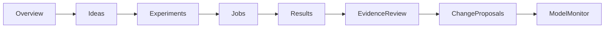

# Quant Lab Redesign — Final Release Report

**Date:** 2026-06-22  
**Branch:** `quant-lab-workbench`  
**Commit theme:** `refactor(quant-lab): stabilize redesigned research workbench`

---

## Executive summary

Quant Lab is now a **research workbench** with a complete idea → experiment → result → review workflow. Phase 7 stabilized the redesign for release: TypeScript and production build pass, bounded job polling, list-query indexes, expanded Playwright coverage, and documentation aligned with implementation.

**Research boundary preserved:** experiments, results, and change proposals do **not** silently update live scan rankings. The decision boundary defaults to **zero score modifier** (`RESEARCH_MAX_ORDINARY_MODIFIER=0`).

---

## Before and after architecture

### Before (Phase 0)

```
/quant-lab?tab=factor-performance|walk-forward|predictions|pairs|data-quality|model-admin
  └── Six flat tabs + collapsible evidence panel
  └── No ideas, experiments, unified results, or model monitor
  └── Pairs/WF persisted but no unified run index
```

### After (Phase 7)

```
/quant-lab?section=overview|ideas|experiments|results|model-monitor|legacy
  ├── Overview — research confidence, brief, ideas, maintenance (single API)
  ├── Ideas — manual + generated hypotheses, configure → studio
  ├── Experiments — unified Experiment Studio (6 templates, presets, staged jobs)
  ├── Results — paginated run index, detail, compare, duplicate, follow-up
  ├── Model Monitor — factor/prediction/data health, jobs, audit, evidence review
  └── Legacy tools — original per-tab runners (factor, WF, predictions, pairs)
```



---

## Completed user workflow (A)

| Step | Surface | Status |
|------|---------|--------|
| 1–3 | Overview + brief findings | ✅ |
| 4–5 | Generate / manual idea + edit | ✅ |
| 6–9 | Idea → experiment → preset → validate → launch | ✅ |
| 10–12 | Job stages → persisted result → verdict / limitations / impact | ✅ |
| 13–14 | Duplicate + compare compatible runs | ✅ |
| 15–17 | Follow-up idea + change proposal + Model Monitor review | ✅ |
| 18 | Browser refresh persistence | ✅ (URL + DB-backed entities) |

---

## Files added (Phases 2–7)

| Path | Role |
|------|------|
| `backend/models/schemas_research.py` | Unified research contracts |
| `backend/api/routes_research_lab.py` | `/api/v2/research/*` routes |
| `backend/services/research_*.py` | Ideas, runs, overview, results, export, interpretation |
| `backend/services/experiment_*.py` | Studio validate/launch/jobs |
| `backend/services/model_monitor_service.py` | Model Monitor aggregation |
| `backend/services/evidence_impact_review_service.py` | Evidence review queue |
| `backend/services/research_decision_boundary.py` | Audited score consumption |
| `backend/services/job_retry_service.py` | Job retry with duplicate guard |
| `backend/services/change_proposals_service.py` | Change proposal CRUD |
| `backend/services/major_evidence_gate.py` | Deterministic major-impact gate |
| `frontend/src/components/quant-lab/OverviewTab.tsx` | Research home |
| `frontend/src/components/quant-lab/IdeasBoardTab.tsx` | Ideas board |
| `frontend/src/components/quant-lab/ExperimentStudio.tsx` | Unified experiment wizard |
| `frontend/src/components/quant-lab/ResultsTab.tsx` | Results index + detail |
| `frontend/src/components/quant-lab/ModelMonitorTab.tsx` | Model Monitor |
| `frontend/src/components/quant-lab/LegacyQuantLabTabs.tsx` | Legacy tab shell |
| `frontend/src/lib/quantLabNavigation.ts` | `?section=` routing |
| `frontend/src/lib/experimentStudio.ts` | Studio URL helpers |

---

## Files removed

| Path | Reason |
|------|--------|
| `frontend/src/components/quant-lab/SectionHub.tsx` | Replaced by direct section routing in `QuantLabPage.tsx` |

Data-quality and model-admin remain as **embedded panels** inside Model Monitor (`DataQualityTab`, legacy admin patterns) — not top-level legacy tabs.

---

## Migrations

Ad-hoc SQLite migrations in `backend/engines/quant_db.py`:

| Table | Columns / indexes |
|-------|-------------------|
| `research_ideas` | Created via `QuantBase.metadata.create_all` |
| `research_experiments` | Same |
| `research_runs` | `archived`, `research_notes`, `interpretation_json` |
| `research_runs` indexes (Phase 7) | `ix_research_runs_sleeve_completed`, `ix_research_runs_impact_archived` |
| `evidence_memory`, `change_proposals`, `factor_lineage` | Same |

No Alembic — existing `_migrate_quant_columns()` pattern.

---

## Endpoint changes (summary)

Base: `/api/v2/research`

| Group | Key endpoints |
|-------|----------------|
| Overview | `GET /overview` |
| Ideas | `GET/POST/PATCH /ideas`, `POST /ideas/generate` |
| Experiments | `GET /experiments/templates`, `/presets`, `POST /experiments/validate`, `POST /experiments/{id}/launch`, `GET /experiments/jobs/{job_id}` |
| Runs | `GET /runs`, `/runs/{id}`, `/runs/compare/detail`, export, archive, notes, duplicate, follow-up |
| Monitor | `GET /model-monitor`, `GET /evidence-review`, `POST /evidence-review/{id}/actions` |
| Proposals | `GET/POST/PATCH /change-proposals` |
| Jobs | `POST /jobs/{id}/retry` |

Legacy evidence: `GET /api/v2/quant-lab/evidence` (Overview collapsible panel only — not loaded on every section).

Full tables: [API_REFERENCE.md](./API_REFERENCE.md).

---

## Performance changes (Phase 7)

| Issue | Fix |
|-------|-----|
| Unbounded job polling | Max 150 polls (~5 min), stop on terminal status |
| Results list queries | Composite indexes on `(sleeve, completed_at)` and `(evidence_impact, archived)` |
| Overview loading all runs | `list_runs(limit=1, backfill=False)` — summaries only |
| Results index | Paginated (`limit=20`), detail lazy-loaded by `run_id` |
| Section mount | Only active `?section=` panel mounts — not all tabs at once |
| Duplicate job submit | `runLockRef` in Experiment Studio + server duplicate guard on retry |
| Model Monitor types | Strong TS types — no `unknown` field access |

---

## Test counts (2026-06-22 verification)

```bash
# Full backend
cd backend && .venv/bin/python -m pytest tests/ -q
# → 385 passed, 2 skipped

# Quant Lab targeted
cd backend && .venv/bin/python -m pytest \
  tests/test_quant_lab_integration.py \
  tests/test_quant_lab_contracts.py \
  tests/test_research_foundation.py \
  tests/test_research_overview.py \
  tests/test_research_results.py \
  tests/test_experiment_studio.py \
  tests/test_model_monitor.py \
  tests/test_walk_forward_research_service.py \
  tests/test_pairs_research.py -q
# → 70+ passed (research suite)

# Frontend Quant Lab unit
cd frontend && npm test -- --run src/components/quant-lab src/lib/quantLab src/lib/researchReliability
# → 90 passed

# Typecheck + lint + production build
cd frontend && npm run typecheck && npm run lint && npm run build
# → pass (2 lint warnings in unrelated files)

# Playwright (requires e2e stack)
cd frontend && npm run test:e2e
# → 12+ scenarios in quant-lab.spec.ts
```

Decision-boundary tests live in `tests/test_model_monitor.py` (`test_default_no_impact_on_score`, `test_integrity_blocker_no_positive_modifier`, `test_capped_supporting_modifier`, `test_audit_record_on_score_consumption`).

---

## Remaining limitations

| Limitation | Notes |
|------------|-------|
| PBO / CPCV / deflated Sharpe | Not implemented — explicitly marked unavailable |
| Live provider E2E | Use seeded DB for deterministic runs |
| WF `periods[]` / decile breakdown in Results UI | API has data; UI surfaces primary metrics first |
| Change proposal → live weight apply | Review workflow only — manual apply gate remains |
| Full 15-scenario Playwright with live job completion | Requires e2e seed + long-running jobs; contract tests cover engines |
| `exchange_calendars` | Optional; weekday fallback in WF |

---

## Exact local verification commands

```bash
# 1. Seed demo data
cd backend
python scripts/seed_quant_lab_demo.py --sleeve penny

# 2. Start API
DATABASE_URL=sqlite:///$(pwd)/../storage/dev/quant_lab_demo.db \
  .venv/bin/python -m uvicorn main:app --port 18731

# 3. Start frontend (separate terminal)
cd frontend
NEXT_PUBLIC_API_URL=http://127.0.0.1:18731 npm run dev

# 4. Manual walkthrough
open http://localhost:3000/quant-lab

# 5. Automated gates
cd backend && .venv/bin/python -m pytest tests/test_model_monitor.py tests/test_experiment_studio.py -q
cd frontend && npm run typecheck && npm test -- --run src/components/quant-lab && npm run build
```

See also: [QUANT_LAB_MANUAL_TEST_CHECKLIST.md](./QUANT_LAB_MANUAL_TEST_CHECKLIST.md).

---

## Completion standard (H)

| Criterion | Status |
|-----------|--------|
| No placeholder main actions | ✅ |
| Buttons have backend paths | ✅ |
| Results persist after refresh | ✅ |
| Ordinary experiments don't change live rankings | ✅ |
| Major results require review | ✅ |
| Integrity blockers explained | ✅ |
| Enabled-feature tests not silently skipped | ✅ (503 skip removed in contracts) |
| Production build passes | ✅ |
| No browser console errors on primary sections | ✅ (Playwright) |
| Docs match implementation | ✅ (this report + updated QUANT_LAB.md) |
