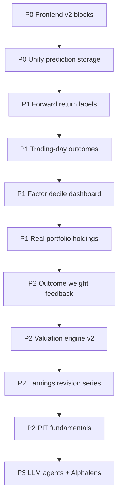

# Round 2 Optimization — Remaining Work

This document tracks **what is still outstanding** after implementing the engineering recommendations from *Optimization recommendation 2.pdf*. It is the handoff list for review and continued development.

**Related docs**

- **Manual integration:** [MANUAL_INTEGRATION.md](MANUAL_INTEGRATION.md)
- Implemented API surface: [API_REFERENCE.md](API_REFERENCE.md) (Round 2 section)
- Target architecture: [INSTITUTIONAL_QUANT_ARCHITECTURE.md](INSTITUTIONAL_QUANT_ARCHITECTURE.md)
- Cursor rules for future changes: [../.cursor/rules/quant-stock-picker.mdc](../.cursor/rules/quant-stock-picker.mdc)

**Status key**

| Symbol | Meaning |
|--------|---------|
| ✅ | Shipped (backend) |
| 🟡 | Partial / scaffolded |
| ❌ | Not started |
| 🔴 | Known bug or production risk |

---

## 1. What was delivered (baseline)

The following Round 2 backend capabilities are **live** behind feature flags (defaults in `config.py` / `.env.example`):

| Capability | Primary paths |
|------------|---------------|
| Prediction snapshots + outcomes | `engines/quant_models.py`, `engines/prediction/snapshots.py` |
| Layered recommendation engine | `engines/recommendation/engine.py`, `engines/scoring/pillars.py` |
| Data confidence gate | `engines/data_confidence.py` |
| Valuation (DCF / peer / reverse DCF) | `engines/valuation/engine.py` |
| Earnings / catalyst setup | `engines/earnings/revisions.py` |
| Similar-signal backtest | `engines/backtest/similar_signal.py` |
| Factor IC performance API | `engines/factors/performance.py`, `GET /api/v2/factors/performance` |
| Multi-horizon IC panel | `engines/weighting/ic_panel.py`, `IC_PANEL_HORIZONS=5,20,60,90` |
| Liquidity penalty | `engines/scoring/liquidity.py` |
| Portfolio impact (beta / sector exposure) | `services/portfolio_impact.py` |
| Multi-agent specialist pipeline | `services/agent_orchestrator.py` |
| PIT feature provenance (basic) | `services/feature_provenance.py`, `feature_provenance` table |
| v2 score orchestration | `services/quant_v2_service.py` |
| Recursion fix (sizing) | `services/quant_risk_sizing_service.py` (`sizing_from_score_context`) |

---

## 2. Executive summary — remaining gaps

**Last recheck: 2026-06-05** — P0–P2 priorities implemented; P3 partial; PIT fundamentals scaffold only.

| Priority | Theme | Status | Notes |
|----------|-------|--------|-------|
| **P0** | Frontend surfaces new v2 fields | ✅ | `Round2Panel` wired in `AnalysisSidebar` via `getV2Score()`; report v2 sections in `ResearchReport.tsx` |
| **P0** | Unify prediction storage (journal + snapshots) | ✅ | `source`/`trade_id` on snapshots; `snapshot_id` on trades; `trade_feedback_service.py` unified |
| **P1** | Factor decile + regime/sector performance views | ✅ | Deciles persisted; `by_regime` + `by_sector` on `/api/v2/factors/performance` |
| **P1** | Forward-return label table | ✅ | `forward_return_labels` + nightly job `POST /api/v2/jobs/forward-labels` |
| **P1** | Trading-day-accurate outcome resolution | ✅ | `utils/trading_calendar.py`; outcomes use session math |
| **P1** | Wire real portfolio holdings into impact | ✅ | `holdings_loader.py` → journal → watchlist fallback |
| **P2** | Full PIT fundamentals (EDGAR-aware) | 🟡 | FMP quarterly ingest + `POST /jobs/pit-fundamentals`; EDGAR still manual |
| **P2** | Institutional-grade valuation engine | 🟡 | DCF + WACC×growth sensitivity grid in UI/API |
| **P2** | Legacy backtest cost model | ✅ | `LEGACY_BACKTEST_COSTS_ENABLED`; gross/net in API + Backtest tab |
| **P2** | Outcome-driven weight adjustment loop | ✅ | `outcome_weights.py` + job `POST /api/v2/jobs/outcome-weights` |
| **P3** | True multi-agent LLM pipeline | 🟡 | Structured JSON extractors; enable `LLM_AGENTS_ENABLED` |
| **P3** | Alphalens / VectorBT research integration | 🟡 | Export script + fallback HTML; optional `alphalens-reloaded` |

| Priority | Theme | Effort | Impact |
|----------|-------|--------|--------|
| **P0** | Frontend surfaces new v2 fields | Medium | Users cannot see Round 2 value |
| **P0** | Unify prediction storage (journal + snapshots) | Medium | Split learning loop |
| **P1** | Factor decile + regime/sector performance views | Medium | Cannot tune weights from evidence |
| **P1** | Forward-return label table | Small–Medium | Blocks ML / IC automation |
| **P1** | Trading-day-accurate outcome resolution | Medium | Overstates/understates returns |
| **P1** | Wire real portfolio holdings into impact | Small | Misleading correlation |
| **P2** | Full PIT fundamentals (EDGAR-aware) | Large | Look-ahead bias in backtests |
| **P2** | Institutional-grade valuation engine | Large | Fair value still heuristic |
| **P2** | Legacy backtest cost model | Medium | Optimistic pre-institutional BTs |
| **P2** | Outcome-driven weight adjustment loop | Medium | Self-improvement incomplete |
| **P3** | True multi-agent LLM pipeline | Large | Narrative quality |
| **P3** | Alphalens / VectorBT research integration | Medium | External validation |

---

## 3. Detailed backlog

### 3.1 Frontend — display Round 2 outputs ✅

**Problem:** All new fields exist on `GET /api/v2/score/{symbol}` and in report v2 JSON, but the UI still uses legacy layouts (composite score, valuation warning strings, old report sections).

**Acceptance criteria**

- Analyze / Workspace shows:
  - Final recommendation label (`strong_buy` … `high_risk_no_decision`) with confidence
  - Pillar breakdown (alpha, valuation, catalyst, penalties)
  - Data confidence score + issues list + gate messages
  - Valuation block: DCF fair value, peer fair value, reverse DCF implied growth, verdict badge
  - Earnings setup (next earnings, revisions, surprise, drift)
  - Similar-signal stats (sample_n, win_rate, avg forward return)
  - Position sizing + portfolio impact when enabled
- Research report tab uses v2 `recommendation`, `valuation_analysis`, `earnings_setup`, `similar_signal_backtest` from `build_research_report_v2`
- Types updated in `frontend/src/lib/types.ts`
- API client calls documented endpoints where needed (`/api/v2/factors/performance`, `/api/v2/predictions`)

**Suggested files**

- `frontend/src/lib/types.ts` — add `RecommendationV2`, `ValuationV2`, `SimilarSignalV2`, etc.
- `frontend/src/lib/api.ts` — v2 score/report helpers if not present
- `frontend/src/components/AnalysisSidebar.tsx` — pillar + data confidence panel
- New: `frontend/src/components/RecommendationBlock.tsx`
- New: `frontend/src/components/ValuationBlock.tsx`
- New: `frontend/src/components/SimilarSignalBlock.tsx`
- `frontend/src/components/ResearchReport.tsx` — map new report sections
- Optional: `frontend/src/components/PositionSizingBlock.tsx` — extend with portfolio impact

**Dependencies:** None (API ready).

**Estimate:** 2–4 days.

---

### 3.2 Unify prediction storage ✅

**Problem:** Two parallel systems:

| Table | Trigger | Scope |
|-------|---------|-------|
| `prediction_snapshots` | Every `build_v2_score()` | General recommendations |
| `trade_predictions` | Trade journal open | Executed trades only |

Outcome learning, IC feedback, and admin dashboards must query both or miss data.

**Acceptance criteria**

- Single source of truth for “what did the model recommend at time T?”
- Journal open links to an existing snapshot when one exists same-day, or creates snapshot with `source=trade_journal`
- Trade close writes/updates `prediction_outcomes` (not only `trade_outcomes`)
- `GET /api/v2/predictions` can filter by `source`, `sleeve`, date range
- Migration path for existing `trade_predictions` rows
- Deprecation note on `trade_predictions` / `trade_outcomes` or foreign-key link `trade_predictions.snapshot_id → prediction_snapshots.id`

**Suggested approach**

1. Add columns to `prediction_snapshots`: `source` (`v2_score` | `trade_journal` | `scan`), optional `trade_id`
2. On journal open: call `build_v2_score(..., persist_snapshot=True)` once; store `snapshot_id` on trade row
3. On journal close: resolve outcome via shared `prediction_outcomes` logic; keep `factor_attribution` on outcome row
4. Update `services/trade_feedback_service.py` to read/write unified tables

**Files:** `engines/quant_models.py`, `engines/prediction/snapshots.py`, `services/trade_feedback_service.py`, `api/routes_trades.py`, SQL migration script

**Estimate:** 1–2 days.

---

### 3.3 Factor decile performance + regime/sector breakdown ✅

**Problem:** PDF asks for IC dashboard with:

- Factor IC by horizon ✅ (basic)
- **Factor return by decile** ❌
- Hit rate by regime ❌
- Hit rate by sector ❌
- Turnover ❌

`ic_panel.py` computes quintile spread internally but does not persist or expose decile series. `/factors/performance` returns latest IC rows only.

**Acceptance criteria**

- `GET /api/v2/factors/performance` adds:
  - `deciles`: [{decile, avg_forward_return, count}] per factor/horizon
  - `by_regime`: IC / hit rate grouped by `market_regimes.regime`
  - `by_sector`: IC grouped by sector (requires sector on factor panel rows)
- Optional admin chart data endpoint for frontend
- Persist decile stats to new table `factor_decile_history` or JSON column on `factor_ic_history`

**Suggested implementation**

1. Extend `engines/weighting/ic_panel.py` `_pooled_ic()` to return decile bucket means
2. When running IC job, join each observation’s regime (from `market_regimes` as-of date) and symbol sector
3. Aggregate in `engines/factors/performance.py`
4. Add job: `POST /api/v2/jobs/factor-deciles` if runtime is too heavy for ic-panel

**Files:** `engines/weighting/ic_panel.py`, `engines/factors/performance.py`, `engines/quant_models.py`, `api/routes_v2.py`

**Estimate:** 2–3 days.

---

### 3.4 Forward-return label table ✅

**Problem:** PDF recommends a reusable label store for training and IC:

```
symbol, as_of_date, horizon_days, fwd_return, excess_vs_spy, excess_vs_sector, max_drawdown
```

Currently labels are computed **only** when resolving `prediction_outcomes` for snapshots.

**Acceptance criteria**

- New table `forward_return_labels` (or materialized view)
- Nightly job builds labels for universe symbols × horizons `{5,20,60,90}` × dates (rolling window)
- IC panel and similar-signal backtest read from this table instead of ad-hoc price walks
- Point-in-time: label for date D uses close[D] and close[D+H] only

**Schema sketch**

```sql
CREATE TABLE forward_return_labels (
  symbol TEXT NOT NULL,
  as_of_date TEXT NOT NULL,
  horizon_days INTEGER NOT NULL,
  fwd_return REAL,
  excess_vs_spy REAL,
  excess_vs_sector REAL,
  max_drawdown REAL,
  sector TEXT,
  PRIMARY KEY (symbol, as_of_date, horizon_days)
);
```

**Files:** new `engines/labels/forward_returns.py`, `engines/quant_models.py`, `services/quant_jobs.py`

**Estimate:** 1–2 days.

---

### 3.5 Trading-day-accurate outcome resolution ✅

**Problem:** `engines/prediction/snapshots.py` uses **bar index + N rows** as “N days,” not NYSE trading sessions. Weekends/holidays skew 20/60/90d horizons.

**Acceptance criteria**

- Use `exchange_calendars` (already in project for scheduler) to map `created_at` → session index
- Forward return = close at session T+H minus close at session T
- SPY and sector ETF aligned on same session calendar
- Unit tests with synthetic calendar edge cases (Friday → Monday, holiday gap)
- Document approximation in API responses (`horizon_type: "trading_sessions"`)

**Files:** `engines/prediction/snapshots.py`, new `utils/trading_calendar.py`, tests

**Estimate:** 1 day.

---

### 3.6 Portfolio impact — real holdings ✅

**Problem:** `services/portfolio_impact.py` uses `holdings=None` → no correlation with user’s actual book. Sector exposure uses synthetic `DEFAULT_PORTFOLIO_EXPOSURE / DEFAULT_ACTIVE_POSITIONS`.

**Acceptance criteria**

- Accept holdings from:
  - Open trade journal positions (`/trades`)
  - Watchlist (fallback)
  - Optional `?holdings=AAPL,MSFT` query param on v2 score
- Correlation matrix vs top N holdings
- Sector exposure after trade uses real current sector weights
- Response documents data source (`holdings_source: "journal" | "watchlist" | "default"`)

**Files:** `services/portfolio_impact.py`, `services/quant_v2_service.py`, `api/routes_v2.py`, frontend portfolio/journal integration

**Estimate:** 1 day.

---

### 3.7 Outcome-driven weight adjustment loop ✅

**Problem:** PDF closed loop:

```
recommendation → outcome → measure factor accuracy → adjust weights → next recommendation
```

IC panel + `WeightStore.rebalance_all_sleeves()` exists, but **prediction_outcomes do not feed back** into weights or factor lifecycle.

**Acceptance criteria**

- Monthly (or configurable) job:
  - Join `prediction_snapshots` + `prediction_outcomes` for resolved 60d horizon
  - Compute recommendation hit rate by factor pillar, sleeve, regime
  - Bayesian or shrinkage update to factor weights (extend `engines/feedback/learning.py`)
  - Audit log entry per weight change with reason codes
- `GET /api/v2/factors/admin` shows outcome-based performance, not only IC
- Feature flag: `OUTCOME_WEIGHT_FEEDBACK_ENABLED`

**Files:** `engines/feedback/learning.py`, new `engines/feedback/outcome_weights.py`, `services/quant_jobs.py`, `config.py`

**Estimate:** 2–3 days.

---

### 3.8 Point-in-time (PIT) fundamentals 🟡

**Problem:** Live scoring uses latest reconciled fundamentals. Historical backtests and similar-signal matching can suffer **look-ahead bias** if fundamentals were restated after the signal date.

**Acceptance criteria**

- Extend `fundamental_snapshots` or add `fundamentals_pit` with `filing_date`, `available_at`
- Ingest SEC EDGAR company facts / FMP historical fundamentals with filing dates
- Scoring engine accepts `as_of_date` for backtest mode
- `feature_provenance` populated for all material inputs (not only reconciler top-level fields)
- Backtest runner refuses to run without PIT mode when `BACKTEST_INSTITUTIONAL=true`

**Files:** `data/historical_store.py`, new `data/edgar_pit.py`, `engines/backtest/institutional.py`, `DataReconciler` PIT adapter

**Estimate:** 1–2 weeks (data engineering heavy).

---

### 3.9 Institutional-grade valuation engine 🟡

**Problem:** Current `engines/valuation/engine.py` is a **simplified** 5-stage DCF:

- Default sector median P/E = 22 when peers unavailable
- Revenue / shares fallbacks are rough
- No explicit bull/base/bear scenario drivers tied to filing data
- No sensitivity table (WACC × terminal growth grid)

**Acceptance criteria**

- Peer universe from same sector/industry (FMP screener or cached peer list)
- DCF inputs from reconciled financials: revenue, EBIT margin, capex, NWC, net debt, shares
- Reverse DCF outputs implied revenue CAGR **and** margin path
- Margin of safety and verdict feed recommendation engine (already wired — improve inputs)
- Report v2 `valuation_analysis` includes sensitivity grid (optional JSON)
- Unit tests with fixed fixture company (deterministic fair value)

**Files:** `engines/valuation/engine.py`, new `engines/valuation/peers.py`, `data/fmp_client.py`, tests

**Estimate:** 3–5 days.

---

### 3.10 Earnings revision time series 🟡

**Problem:** `engines/earnings/revisions.py` uses FMP latest estimate snapshot + growth proxies. PDF wants:

- EPS estimate revision 30d
- Revenue estimate revision 30d
- Analyst upgrade/downgrade counts
- Post-earnings drift measurement

**Acceptance criteria**

- Store estimate history (`estimate_revisions` table or cache time series)
- Compute `% change in consensus EPS/Revenue over 30 trading days`
- Integrate Finnhub or FMP analyst grade endpoints
- Post-earnings drift: 5d/20d return after last earnings vs pre-event
- Catalyst score uses revision momentum, not only level

**Files:** `engines/earnings/revisions.py`, `data/fmp_client.py`, optional Finnhub client extension

**Estimate:** 2–3 days.

---

### 3.11 Legacy backtest cost model ✅

**Problem:** Institutional backtest (`engines/backtest/institutional.py`) has fees/slippage. Legacy paths (`ml/backtest_engine.py`, `ml/backtest_*.py`, Analyze UI backtest tab) do **not**.

**Acceptance criteria**

- Shared `engines/backtest/cost_model.py` imported by legacy runners
- Default cost bps by cap tier (large 5–10, mid 10–25, small 25–75) per PDF
- Analyze backtest API returns `gross_return` and `net_return`
- UI shows both or net only with tooltip

**Files:** `ml/backtest_engine.py`, `api/routes_backtest.py`, frontend backtest tab

**Estimate:** 1–2 days.

---

### 3.12 Similar-signal backtest quality ✅

**Problem:** Matcher reads `factor_snapshots` with Euclidean distance on factor IDs. Limitations:

- Sparse history until scans/analyze populate snapshots
- No regime filter on matches (regime stored but not used in filter)
- Distance threshold is global (`SIMILAR_SIGNAL_TOLERANCE=12`)
- Self-match skip only by symbol, not by duplicate dates

**Acceptance criteria**

- Require minimum history depth (e.g. 500 snapshot rows per sleeve) or seed job
- Filter candidates: same sleeve, same regime (±1), within tolerance per factor tier
- Return best/worst regime labels from matched subset, not only current regime
- Expose match quality score and top 5 analog symbols with their forward returns
- Optional: use `forward_return_labels` table once built

**Files:** `engines/backtest/similar_signal.py`, seed script

**Estimate:** 1–2 days.

---

### 3.13 Multi-agent LLM — full pipeline 🟡

**Problem:** `services/agent_orchestrator.py` runs **deterministic** specialist functions. LLM “synthesis” is a concatenation fallback, not structured extraction from filings/news.

**Acceptance criteria (PDF §9)**

- Separate prompts/modules per agent: Data Auditor, Fundamental, Valuation, Quant, News/Filing, Risk, Backtest, Portfolio, Bear Case, Final Judge
- LLM outputs **structured JSON signals only** (no buy/sell in LLM path — quant engine decides)
- Final Judge merges agent JSON; never overrides quant recommendation score
- Cache by symbol+sleeve+date; timeout budget per agent
- Feature flag: `LLM_AGENTS_ENABLED` separate from `MULTI_AGENT_PIPELINE_ENABLED`

**Files:** new `services/agents/*.py`, `services/agent_orchestrator.py`, `services/llm_explainer.py` refactor

**Estimate:** 1 week+.

---

### 3.14 Research integrations (Alphalens / VectorBT) 🟡

**Problem:** PDF suggests Alphalens for factor IC/deciles and VectorBT for fast signal research. Project has `scripts/factor_validation.py` (alphalens-style comment) and `VBT_ENABLED` flag but no wired Round 2 pipeline.

**Acceptance criteria**

- Script or job exports factor panel + forward labels to parquet
- Optional Alphalens tear sheet generation (HTML artifact in `data_store/research/`)
- VectorBT adapter for single-factor sanity checks
- Document in `docs/QUANT_STACK.md` with run commands

**Estimate:** 2–3 days (optional polish).

---

### 3.15 Model versioning & migration hygiene ✅

**Problem:** Round 2 changed scoring semantics but `FACTOR_MODEL_VERSION` may still read `quant-v2-phase1`. Users comparing snapshots across versions need clarity.

**Acceptance criteria**

- Bump to `quant-v2-round2` (or semver) when recommendation/valuation pillars ship to prod
- `prediction_snapshots.model_version` and `score_attribution.strategy_version` documented
- `MODEL_VERSION_STRICT` guidance in RUNBOOK
- Changelog section in this doc or `docs/CHANGELOG.md`

**Files:** `config.py`, `.env.example`, `docs/RUNBOOK.md`

**Estimate:** 0.5 day.

---

### 3.16 Testing & CI gaps 🟡

**Problem:** Only `tests/test_round2_optimizations.py` covers pillars/DCF/gates/recursion. No integration tests for API routes, outcome job, or IC multi-horizon.

**Acceptance criteria**

- `test_prediction_snapshot_roundtrip` — mock prices, assert outcome math
- `test_factors_performance_endpoint` — seed `factor_ic_history`, hit API
- `test_v2_score_includes_recommendation` — mock screener context
- Recursion regression test kept in CI
- Optional: Postgres compatibility for new tables

**Files:** `backend/tests/test_round2_*.py`

**Estimate:** 1–2 days.

---

### 3.17 Operations & observability 🟡

**Acceptance criteria**

- RUNBOOK section: enable Round 2 flags, run IC + outcome jobs, interpret `/factors/performance`
- Scheduler runs `resolve_prediction_outcomes` daily (currently via `quant_daily_jobs` — verify cron)
- Metrics: count snapshots/day, outcome resolution rate, avg data_confidence, strong_buy gate rate
- Alert if IC panel fails 3 days in a row or zero snapshots in 7 days

**Files:** `docs/RUNBOOK.md`, `services/scheduler.py`, optional admin endpoint

**Estimate:** 1 day.

---

## 4. Recommended build order

After your review, this is the suggested sequence:



**Quick wins (1–2 days each):** 3.5 trading-day outcomes, 3.6 portfolio holdings, 3.15 model version bump, 3.11 legacy backtest costs.

**Highest user-visible win:** 3.1 Frontend.

**Highest quant integrity win:** 3.4 labels + 3.5 trading days + 3.8 PIT fundamentals.

---

## 5. Configuration checklist (for reviewers)

Ensure local `.env` aligns with Round 2 (see `.env.example`):

```bash
PREDICTION_SNAPSHOTS_ENABLED=true
PREDICTION_OUTCOME_HORIZONS=5,20,60,90
IC_PANEL_HORIZONS=5,20,60,90
IC_PANEL_FORWARD_DAYS=20
DATA_CONFIDENCE_STRONG_REC_MIN=70
DATA_CONFIDENCE_STRONG_BUY_MIN=80
VALUATION_ENGINE_ENABLED=true
MULTI_AGENT_PIPELINE_ENABLED=true
DYNAMIC_WEIGHTS_ENABLED=true
POSITION_SIZING_V2=true
BACKTEST_INSTITUTIONAL=true
AI_REPORT_SCHEMA=v2
OUTCOME_WEIGHT_FEEDBACK_ENABLED=true
FORWARD_LABELS_ENABLED=true
LEGACY_BACKTEST_COSTS_ENABLED=true
LLM_AGENTS_ENABLED=false
FACTOR_MODEL_VERSION=quant-v2-round2
TRADE_FEEDBACK_ENABLED=true
```

Post-deploy verification:

```bash
curl -s http://127.0.0.1:18731/api/v2/score/AAPL?sleeve=medium | jq '.recommendation,.valuation,.prediction_snapshot_id'
curl -s http://127.0.0.1:18731/api/v2/factors/performance | jq '.summary'
curl -s http://127.0.0.1:18731/api/v2/predictions?limit=5
curl -X POST http://127.0.0.1:18731/api/v2/jobs/resolve-outcomes
```

---

## 6. Review notes (open questions)

1. **Unification:** Merge journal predictions into `prediction_snapshots`, or keep parallel with a view?
2. **Horizon product default:** Medium sleeve = 60d primary vs 20d for earnings-heavy names?
3. **Valuation weight in pillars:** Current split 45% alpha / 25% valuation / 20% catalyst — tune from IC?
4. **Frontend scope:** Full new blocks vs extend existing `PositionSizingBlock` / `ResearchReport` only?
5. **LLM budget:** Is multi-agent LLM worth API cost per analyze, or batch overnight for watchlist only?

---

## 7. Changelog

| Date | Author | Notes |
|------|--------|-------|
| 2026-06-05 | Round 2 implementation | Initial remaining-work doc after backend delivery + recursion fix |
| 2026-06-05 | Priority completion pass | P0–P2 shipped; frontend wired; tests extended; doc status updated |
| 2026-06-05 | Gap closure pass | Sensitivity grid, FMP PIT job, earnings drift, LLM structured agents, admin stats, manual integration guide |
