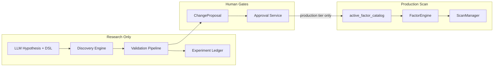

# Factor Discovery — Recommended Architecture

Grounded in the existing Stock Picker repository. Extends current Quant Lab patterns; does not replace them.

---

## Design principles (from requirements)

1. LLM proposes hypotheses and translates to a **controlled DSL** — never computes numbers.
2. **Deterministic engine** evaluates factors and runs validation.
3. Every experiment recorded; **failed experiments remain visible**.
4. Chronological **discovery / validation / sealed-test** periods enforced in code.
5. Only **approved, versioned** factors enter paper mode or production Scan.
6. LLM cannot approve production factors, execute arbitrary code, or access future data.

---

## Component map

**Phase 1 shipped (contracts only):**

| Component | Location | Status |
|-----------|----------|--------|
| FactorHypothesis | `models/schemas_factor_discovery.py::FactorHypothesis` | ✅ Pydantic |
| FactorDefinition | `models/schemas_factor_discovery.py::FactorDefinition` | ✅ Pydantic |
| FactorExpression AST | `models/schemas_factor_discovery.py` (discriminated union) | ✅ JSON round-trip |
| formula_hash | `models/schemas_factor_discovery.py::formula_hash` | ✅ SHA-256 canonical |
| DiscoveryPeriodSplit | `models/schemas_factor_discovery.py::DiscoveryPeriodSplit` | ✅ Validated |
| Lifecycle transitions | `can_transition_factor_status`, `validate_factor_status_transition` | ✅ |
| factor_discovery experiment | `ExperimentType` + disabled launch | ✅ |

**Phase 2 shipped (parser & compiler — no execution):**

| Component | Location | Status |
|-----------|----------|--------|
| Controlled factor DSL | `engines/factor/discovery/parser.py`, `tokenizer.py` | ✅ `factor-dsl-v1` |
| Canonical formatter | `engines/factor/discovery/formatter.py` | ✅ Round-trip stable |
| Field registry | `engines/factor/discovery/field_registry.py` | ✅ Whitelist + outcome forbid |
| Factor compiler | `engines/factor/discovery/compiler.py` | ✅ `CompiledFactorPlan` |
| Data-source policy | `field_registry.py::FactorDataSourcePolicy` | ✅ `research_adjusted_daily_v1` |

**Phase 3+ (not shipped):**

| Component | Extend vs New | Proposed location | Notes |
|-----------|---------------|-------------------|-------|
| **FactorHypothesis** | **Extend** `ResearchIdea` | `models/schemas_factor_discovery.py` | Add `financial_rationale`, `expected_mechanism`, `data_dependencies[]` |
| **FactorDefinition** | **Extend** `FactorDefinition` + catalog | `engines/factor/discovery/definition.py` | Versioned approved spec; separate from experimental AST |
| **FactorExpression AST** | **New** | `engines/factor/discovery/ast.py` | Immutable tree; JSON-serializable |
| **Controlled factor DSL** | **New** (inspired by `openalpha_registry.json` strings) | `engines/factor/discovery/dsl.py` | Whitelist ops/fields; no `eval()` |
| **Factor compiler** | **New** | `engines/factor/discovery/compiler.py` | AST → execution plan over allowed column refs |
| **Factor calculation engine** | **Extend** `FactorEngine` + `quant_core/features.py` | `engines/factor/discovery/engine.py` | Cross-section panel compute; PIT inputs only |
| **Factor experiment engine** | **Extend** `experiment_launch_service` | `services/factor_discovery_experiment_service.py` | New `experiment_type: factor_discovery` |
| **Validation pipeline** | **Extend** walk-forward + scan_eval metrics | `services/factor_discovery_validation_service.py` | Reuse `cross_section_metrics()` |
| **Factor registry** | **Extend** `catalog.py` + `FactorDefinition` table | `engines/factor/discovery/registry.py` | States: `draft`, `paper`, `production` |
| **Experiment ledger** | **Extend** `ResearchRunIndex` + new table | `engines/quant_models.py` → `FactorDiscoveryRun` | Full hypothesis→formula→metrics lineage |
| **LLM hypothesis generator** | **New** | `services/factor_discovery_llm/hypothesis.py` | Structured output; schema-validated |
| **LLM formula translator** | **New** | `services/factor_discovery_llm/translator.py` | Hypothesis → DSL AST only |
| **LLM experiment critic** | **New** | `services/factor_discovery_llm/critic.py` | Reviews failed runs; suggests revision text only |
| **Controlled revision loop** | **New** | `services/factor_discovery_revision_service.py` | Max iterations; human checkpoint |
| **Quant Lab Factor Discovery UI** | **Extend** Experiment Studio | `frontend/src/components/quant-lab/FactorDiscoveryTab.tsx` | New section or studio template |
| **Paper-factor integration** | **Extend** OpenAlpha pattern | `openalpha_registry.json` → dynamic research registry | `tier: paper`, `enabled_live: false` |
| **Production approval** | **Extend** `change_proposals_service` | `services/factor_discovery_approval_service.py` | Links proposal → catalog merge |
| **Scan factor adapter** | **Extend** `FactorEngine.build_signals()` | `engines/factor/discovery/scan_adapter.py` | Loads only `production` tier |
| **Drift monitoring** | **Extend** `model_monitor_service` | `services/factor_drift_monitor_service.py` | IC decay vs discovery baseline |

---

## Detailed component specifications

### FactorHypothesis contract

**Extend:** `models/schemas_research.py::ResearchIdeaCreate` fields.

**New fields (proposed Pydantic model):**

```python
class FactorHypothesis(BaseModel):
    id: str
    title: str
    financial_rationale: str      # LLM or user — prose only
    economic_mechanism: str       # e.g. "short-term mean reversion after volume spike"
    null_hypothesis: str
    required_fields: list[str]    # must ⊆ DSL field whitelist
    forbidden_fields: list[str]   # e.g. future returns
    sleeve: Literal["penny", "compounder"]
    status: Literal["proposed", "translated", "testing", "validated", "rejected", "approved"]
    source: Literal["llm", "user", "brief", "revision"]
    parent_hypothesis_id: str | None
```

**Persistence:** `research_ideas` table with `source_type` extended or JSON in `suggested_parameters_json`.

**LLM allowed:** Generate/update prose fields, suggest `required_fields` from whitelist.  
**LLM forbidden:** Set `status=approved`, assign weights, reference future metrics.

---

### FactorDefinition contract

**Extend:** `engines/quant_models.py::FactorDefinition` + `engines/factor/catalog.py::FactorSpec`.

```python
class DiscoveredFactorDefinition(BaseModel):
    factor_id: str                 # e.g. disc_penny_vol_momentum_v1
    display_name: str
    sleeve: str
    formula_ast_json: str          # immutable once run starts
    formula_hash: str              # SHA-256 of canonical AST
    dsl_version: str               # e.g. "fdsl-1"
    data_version: str              # price panel + fundamental snapshot ids
    lifecycle_state: Literal["experimental", "paper", "production", "retired"]
    discovery_run_id: str
    validation_run_id: str | None
    sealed_test_run_id: str | None
    approved_by: str | None        # human / proposal id — never LLM
    factor_model_version_bump: str | None
```

**Reuse:** `FactorLineage` for per-date calculation metadata (`factor_lineage_service.py`).

---

### FactorExpression AST

**New module:** `engines/factor/discovery/ast.py`

Node types (closed set):

| Node | Children | Example |
|------|----------|---------|
| `FieldRef` | `name` | `close`, `volume`, `pe_ratio` |
| `Const` | `value` | `5`, `0.02` |
| `UnaryOp` | `op`, `child` | `neg`, `log`, `rank`, `zscore` |
| `BinaryOp` | `op`, `left`, `right` | `add`, `sub`, `mul`, `div` |
| `RollingOp` | `op`, `window`, `child` | `ts_mean`, `ts_std`, `ts_corr` |
| `CrossSectionOp` | `op`, `child` | `cs_rank`, `cs_zscore` |
| `LagOp` | `periods`, `child` | `lag(close, 5)` |

**Deterministic:** AST hash stored with every run. Compiler rejects unknown nodes.

**Relation to existing code:** `openalpha_registry.json` `expression` strings are **not parsed** today — `evaluate_formula()` dispatches to `OPENALPHA_SCORERS`. New compiler replaces string dispatch for discovered factors only.

---

### Controlled factor DSL

**New:** `engines/factor/discovery/dsl.py`

**Field whitelist** (initial, from data inventory):

- Price: `open`, `high`, `low`, `close`, `volume`
- Derived (engine-computed): `ret1`, `dollar_volume`, `vwap` (from OHLCV only)
- Fundamentals (PIT-gated): `pe_ratio`, `roe`, `revenue_ttm`, `market_cap`, `profit_margin` via `get_pit_metric()`
- Benchmark: `spy_close`, `spy_ret1` (explicit join, no implicit future)

**Forbidden:** `fwd_return`, `fwd_excess`, any column with date > `as_of_date`.

**Ops whitelist:** Mirror `quant_core/features.py` + cross-section from `stage_a_ranking._percentile_scores()`.

**Parser:** Lark or hand-written recursive descent — **no** `eval()`, `exec()`, `compile()`.

---

### Factor compiler

**New:** `engines/factor/discovery/compiler.py`

```
compile(ast, *, sleeve, as_of_date) → CompiledFactorPlan
  - validates field whitelist
  - binds data loaders (PriceService panel truncated at as_of_date)
  - returns callable: (symbols: list[str], panel: DataFrame) → Series[float]
```

**Dependencies:** `scan_evaluation_pit.truncate_history()`, `data/price_service.py`, optional `pit_fundamentals.get_pit_metric()`.

**Output:** `CompiledFactorPlan` with `required_lookback_sessions`, `field_deps`, `formula_hash`.

---

### Factor calculation engine

**New:** `engines/factor/discovery/engine.py`

```
compute_factor_panel(plan, symbols, start_date, end_date) → pd.DataFrame
  columns: [date, symbol, raw_value, norm_score]
```

**Normalization reuse:** `stage_a_ranking._percentile_scores()` or `quant_core/features.rolling_zscore()`.

**Winsorization:** Same winsorize bounds as Stage A (`stage_a_ranking`).

**Must remain deterministic:** Same AST + data version + date range → identical panel (modulo float tolerance).

---

### Factor experiment engine

**Extend:** `experiment_launch_service._dispatch_experiment()` with new branch.

**New service:** `services/factor_discovery_experiment_service.py`

```
run_factor_discovery_experiment(config: FactorDiscoveryExperimentConfig) → run_id
  1. Load hypothesis + compiled AST (or compile on launch)
  2. Split dates: discovery_end, validation_end, sealed_test_end (config)
  3. discovery period: compute panel, IC metrics only (no parameter tuning on validation)
  4. validation period: frozen formula, cross_section_metrics per rebalance
  5. sealed test: single pass, no revision allowed
  6. persist FactorDiscoveryRun + index via notify_run_persisted
```

**Reuse:**

- `walk_forward_research_service.rebalance_dates()`, `universe_for_date()`
- `cross_section_metrics()` for rank IC, hit rate, quintiles
- `experiment_job_service` stages

**New experiment type:** Add `factor_discovery` to `ExperimentType` in `schemas_research.py`.

---

### Validation pipeline

**New:** `services/factor_discovery_validation_service.py`

| Metric | Source function | Period |
|--------|-----------------|--------|
| Rank IC | `cross_section_metrics()` | Per rebalance in validation |
| Pearson IC | same | Same |
| Hit rate | same | Same |
| Quintile spread | same | Same |
| Turnover | `turnover_rate()` | Same |
| Decile breakdown | `scan_evaluation_metrics.score_decile_breakdown()` | Optional |
| Sector exposure | New wrapper over panel | Partial — sector from `info.sector` |
| Multiple-testing | Bonferroni on discovery batch count | New — simple counter in ledger |
| Transaction costs | `scan_evaluation_pit.apply_penny_friction()` for penny sleeve | Research labels only |

**Not in v1:** PBO, CPCV, full regime-conditional IC (flagged partial in `ic_panel`).

**Chronological enforcement:**

```python
assert discovery_end < validation_start < sealed_test_start
assert_no_lookahead(panel, as_of=rebalance_date)  # scan_evaluation_pit
```

---

### Factor registry

**Extend:** `engines/factor/catalog.py::active_factor_catalog()`

```
get_factors_for_mode(mode: Literal["research", "paper", "production"]) → list[FactorSpec]
```

| Mode | Source |
|------|--------|
| `research` | `FactorDiscoveryRun` completed experiments only |
| `paper` | Registry entries with `lifecycle_state=paper` + env `PAPER_FACTORS_ENABLED` |
| `production` | Static catalog + `lifecycle_state=production` |

**Scan adapter** (`scan_adapter.py`): `production` mode only. Research/paper factors **never** called from `ScanManager`.

**Reuse:** OpenAlpha gating pattern (`OPENALPHA_FACTORS_ENABLED` + `enabled_live`).

---

### Experiment ledger

**Extend:** `ResearchRunIndex` + new payload table.

**Proposed model:** `FactorDiscoveryRun` in `quant_models.py`

| Column | Purpose |
|--------|---------|
| `run_id` | PK |
| `hypothesis_id` | FK → research_ideas |
| `formula_ast_json` | Immutable |
| `formula_hash` | Dedup / drift detection |
| `discovery_metrics_json` | IC etc. on discovery window |
| `validation_metrics_json` | Frozen formula on validation window |
| `sealed_test_metrics_json` | Final holdout |
| `status` | `completed` / `failed` |
| `failure_stage` | `compile` / `discovery` / `validation` / `sealed_test` |
| `error_message` | Always set on failure |
| `revision_number` | Int, max enforced |

**Failed runs:** Always insert row with `status=failed` before re-raising — fixes current gap where only jobs retain failures.

**Reuse:** `research_run_service.notify_run_persisted()` + new `adapter_factor_discovery`.

---

### LLM layer

**New package:** `services/factor_discovery_llm/`

| Module | Input | Output | Controls |
|--------|-------|--------|----------|
| `hypothesis.py` | Sleeve, brief findings, field whitelist | `FactorHypothesis` draft | `max_tokens`, schema validation, no numeric fields |
| `translator.py` | Approved hypothesis | DSL AST JSON | Parser validates; reject on compile error |
| `critic.py` | Failed run metrics + error | Revision suggestions (prose + AST patch proposal) | Cannot approve; cannot change sealed test results |

**Reuse patterns from:**

- `llm_explainer.py` — JSON schema hint, banned patterns
- `research_run_interpretation_service.sanitize_llm_prose()` — anti-override

**Config flags (proposed):**

- `FACTOR_DISCOVERY_LLM_ENABLED` (default `false`)
- `FACTOR_DISCOVERY_MAX_REVISIONS` (default `3`)

**LLM never:**

- Calls `compile()` with unsanitized strings as code
- Reads `forward_return_labels` for dates after experiment `as_of`
- Writes to `FactorWeight` or `factor_definitions` with `is_active=true`

---

### Controlled revision loop (Phase 7 — shipped)

**Implemented:** `backend/services/factor_discovery/mining/` — bounded session orchestrator, not a general agent.

```
authorize_mining_session → advance_mining_session (max 10 steps)
  - immutable budgets + validation exposure ledger
  - revision diff policy in mining/revision_step.py
  - no sealed access, no lifecycle auto-promotion
```

See [factor-discovery-mining-loop.md](./factor-discovery-mining-loop.md).

---

### Quant Lab Factor Discovery UI

**Extend:** `ExperimentStudio.tsx` or new `?section=factor-discovery`.

**Screens:**

1. Hypothesis board (link to Ideas with `source_type=llm_hypothesis`)
2. Formula review (AST pretty-print, field deps, compile preview)
3. Period config (discovery / validation / sealed test dates)
4. Run status (reuse job stages)
5. Results (IC charts via `build_charts()` extension)
6. Revision history (all attempts visible, including failures)

**Reuse components:** `ResearchReliabilityCard`, `ResultsTab` detail drawer, `MetricTile`, Recharts patterns from `WalkForwardTab.tsx`.

---

### Paper-factor integration

**Pattern:** Mirror `openalpha_registry.json` + `append_openalpha_signals()`.

1. Approved discovery → `lifecycle_state=paper`
2. Env `PAPER_FACTORS_ENABLED=true` merges into `active_factor_catalog()` with `tier=paper`
3. `enabled_live=false` — visible in Workspace analyze, **not** Scan Stage B

**File:** `engines/factor/discovery/paper_registry.json` (generated from approved runs, not hand-edited).

---

### Production-factor approval

**Flow:**

```
FactorDiscoveryRun (sealed_test passed)
  → ChangeProposal (change_proposals_service.create_proposal)
  → human review → status=approved_for_staging
  → factor_discovery_approval_service.promote_to_production()
      - inserts FactorDefinition row
      - bumps FACTOR_MODEL_VERSION (config + audit)
      - merges into catalog.py or DB-backed catalog
      - audit_log()
```

**Reuse:** `major_evidence_gate.evaluate_major_evidence_gate()`, `research_decision_boundary._approved_staging_proposal()`.

**Scan adapter:** Only after `lifecycle_state=production` and version pin updated.

---

### Scan factor adapter

**File:** `engines/factor/discovery/scan_adapter.py`

```python
def append_discovered_production_signals(signals, sleeve, hist, info, fundamentals):
    if not PRODUCTION_DISCOVERED_FACTORS_ENABLED:
        return signals
    for spec in registry.get_factors_for_mode("production"):
        if spec.sleeve != sleeve:
            continue
        # load compiled plan from registry cache
        ...
```

Called from `FactorEngine.build_signals()` **after** static catalog, **before** weight normalization.

**Isolation:** `experiment_launch_service` and research registry paths never import `scan_adapter`.

---

### Drift monitoring

**Extend:** `services/model_monitor_service.py::get_model_monitor()`

Add card: per production discovered factor — rolling 60d IC vs discovery baseline; alert if IR decay > threshold.

**Reuse:** `factor_lifecycle.build_factor_admin()` thresholds.

---

## Scan integration (production gate)



**Hard rules:**

1. `ScanManager` imports only `active_factor_catalog()` — never `factor_discovery_experiment_service`.
2. Research factors stored in separate table/registry file from production catalog.
3. `FACTOR_MODEL_VERSION` bump required for any production merge.
4. `OPENALPHA_FACTORS_ENABLED` pattern duplicated for `PRODUCTION_DISCOVERED_FACTORS_ENABLED`.

---

## Validation capability reuse matrix

| Capability | Existing | Status | Reuse for discovery |
|------------|----------|--------|---------------------|
| Forward returns | `scan_evaluation_pit`, `quant_core/labels.py` | Production-ready | Yes |
| Rank IC | `cross_section_metrics()` | Production-ready | **Primary metric** |
| Pearson IC | `cross_section_metrics()` | Production-ready | Secondary |
| Quantile/decile returns | `score_decile_breakdown()`, `ic_panel` deciles | Production-ready | Yes |
| Walk-forward rebalance | `rebalance_dates()`, `run_walk_forward_research` | Production-ready | Period splitter |
| Train/test split | 70/30 in `backtest_engine` only | Partial | **Do not reuse** — use 3-period chronological |
| Transaction costs | `cost_model`, `apply_penny_friction` | Partial | Penny labels only in v1 |
| Turnover | `turnover_rate()` | Production-ready | Yes |
| Drawdown / Sharpe | `engines/backtest/metrics.py` | Production-ready | Portfolio sim only |
| Regime analysis | `regime_classifier`, partial decile by regime | Partial | v2 |
| Sector exposure | Sector IC in `ic_panel` | Partial | v2 |
| Correlation / redundancy | — | **Missing** | v2 — pairwise IC matrix |
| Statistical significance | — | **Missing** | v1 simple Bonferroni |
| Multiple-testing controls | — | **Missing** | v1 experiment counter |
| Benchmark comparison | Institutional backtest | Partial | Not required for factor IC v1 |
| PBO / CPCV | — | **Missing** | Out of scope v1 |

---

## What must remain deterministic

| Component | Deterministic? |
|-----------|----------------|
| AST compilation | Yes |
| Panel computation | Yes |
| IC / decile metrics | Yes |
| Period splits | Yes (config-driven, logged) |
| Verdict / reliability | Yes (`build_interpretation`) |
| Registry promotion | Yes (human-triggered, audited) |
| LLM hypothesis text | No (but doesn't affect metrics) |
| LLM prose interpretation | No (optional, default off) |

---

## Dependencies (no new runtime deps in audit phase)

Implementation phase may use existing stack only:

- `pandas`, `numpy` (already present)
- Optional `lark` for DSL — evaluate against hand-written parser first to avoid new dep

---

## Related

- [factor-discovery-audit.md](./factor-discovery-audit.md)
- [factor-discovery-implementation-plan.md](./factor-discovery-implementation-plan.md)
- [factor-discovery-risk-register.md](./factor-discovery-risk-register.md)
- [FACTOR_RESEARCH_FINAL_ACCEPTANCE.md](../FACTOR_RESEARCH_FINAL_ACCEPTANCE.md) — Phase 11 isolation + acceptance
- [isolation_audit.py](../../backend/services/factor_discovery/isolation_audit.py) — research→production write path audit
